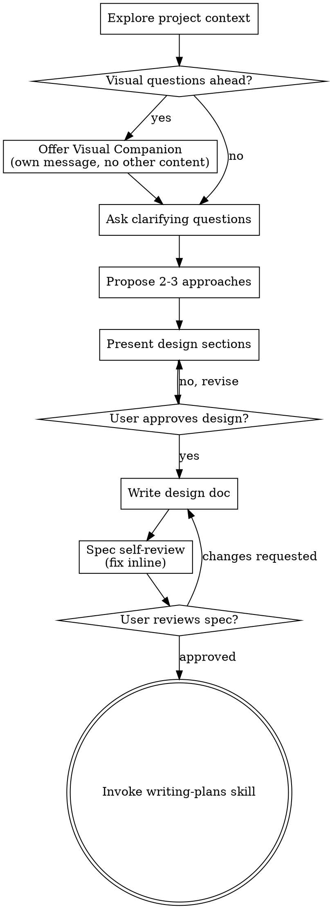

<!-- Generated by SpecStory, Markdown v2.1.0 -->

# 2026-05-29 10:43:03Z

<!-- Claude Code Session d905e4aa-668e-4827-9e1c-d3f322750837 (2026-05-29 10:43:03Z) -->

_**User (2026-05-29 10:43:03Z)**_

new feature. I need a user level or role that for this kind of role, it can see the reports of all the vessels registered to the app, usually the "General Report Viewer Role" then a specific vessel reports with a different kind of role will be set to a user that can only see 1 or multiple vessel reports, the role name would be "Report Viewer Role" and allow the admin to select what vessel or vessels this user that had this kind of role can only see. The reports im referring is the same as all the reports you made except for "Report Viewer Role" can only see report summary and specific reports like sales everyday to only that vessel, if you understand what im saying

---

_**Agent (claude-opus-4-7 2026-05-29 10:43:07Z)**_

_**Agent (claude-opus-4-7 2026-05-29 10:43:07Z)**_

<tool-use data-tool-type="generic" data-tool-name="Skill"><details>
<summary>Tool use: **Skill**</summary>

**Input:**

- skill: `superpowers:brainstorming`

</details></tool-use>

---

_**User (2026-05-29 10:43:07Z)**_

Base directory for this skill: /home/me/.claude/plugins/cache/claude-plugins-official/superpowers/5.1.0/skills/brainstorming

# Brainstorming Ideas Into Designs

Help turn ideas into fully formed designs and specs through natural collaborative dialogue.

Start by understanding the current project context, then ask questions one at a time to refine the idea. Once you understand what you're building, present the design and get user approval.

<HARD-GATE>
Do NOT invoke any implementation skill, write any code, scaffold any project, or take any implementation action until you have presented a design and the user has approved it. This applies to EVERY project regardless of perceived simplicity.
</HARD-GATE>

## Anti-Pattern: "This Is Too Simple To Need A Design"

Every project goes through this process. A todo list, a single-function utility, a config change — all of them. "Simple" projects are where unexamined assumptions cause the most wasted work. The design can be short (a few sentences for truly simple projects), but you MUST present it and get approval.

## Checklist

You MUST create a task for each of these items and complete them in order:

1. **Explore project context** — check files, docs, recent commits
2. **Offer visual companion** (if topic will involve visual questions) — this is its own message, not combined with a clarifying question. See the Visual Companion section below.
3. **Ask clarifying questions** — one at a time, understand purpose/constraints/success criteria
4. **Propose 2-3 approaches** — with trade-offs and your recommendation
5. **Present design** — in sections scaled to their complexity, get user approval after each section
6. **Write design doc** — save to `docs/superpowers/specs/YYYY-MM-DD-<topic>-design.md` and commit
7. **Spec self-review** — quick inline check for placeholders, contradictions, ambiguity, scope (see below)
8. **User reviews written spec** — ask user to review the spec file before proceeding
9. **Transition to implementation** — invoke writing-plans skill to create implementation plan

## Process Flow



**The terminal state is invoking writing-plans.** Do NOT invoke frontend-design, mcp-builder, or any other implementation skill. The ONLY skill you invoke after brainstorming is writing-plans.

## The Process

**Understanding the idea:**

- Check out the current project state first (files, docs, recent commits)
- Before asking detailed questions, assess scope: if the request describes multiple independent subsystems (e.g., "build a platform with chat, file storage, billing, and analytics"), flag this immediately. Don't spend questions refining details of a project that needs to be decomposed first.
- If the project is too large for a single spec, help the user decompose into sub-projects: what are the independent pieces, how do they relate, what order should they be built? Then brainstorm the first sub-project through the normal design flow. Each sub-project gets its own spec → plan → implementation cycle.
- For appropriately-scoped projects, ask questions one at a time to refine the idea
- Prefer multiple choice questions when possible, but open-ended is fine too
- Only one question per message - if a topic needs more exploration, break it into multiple questions
- Focus on understanding: purpose, constraints, success criteria

**Exploring approaches:**

- Propose 2-3 different approaches with trade-offs
- Present options conversationally with your recommendation and reasoning
- Lead with your recommended option and explain why

**Presenting the design:**

- Once you believe you understand what you're building, present the design
- Scale each section to its complexity: a few sentences if straightforward, up to 200-300 words if nuanced
- Ask after each section whether it looks right so far
- Cover: architecture, components, data flow, error handling, testing
- Be ready to go back and clarify if something doesn't make sense

**Design for isolation and clarity:**

- Break the system into smaller units that each have one clear purpose, communicate through well-defined interfaces, and can be understood and tested independently
- For each unit, you should be able to answer: what does it do, how do you use it, and what does it depend on?
- Can someone understand what a unit does without reading its internals? Can you change the internals without breaking consumers? If not, the boundaries need work.
- Smaller, well-bounded units are also easier for you to work with - you reason better about code you can hold in context at once, and your edits are more reliable when files are focused. When a file grows large, that's often a signal that it's doing too much.

**Working in existing codebases:**

- Explore the current structure before proposing changes. Follow existing patterns.
- Where existing code has problems that affect the work (e.g., a file that's grown too large, unclear boundaries, tangled responsibilities), include targeted improvements as part of the design - the way a good developer improves code they're working in.
- Don't propose unrelated refactoring. Stay focused on what serves the current goal.

## After the Design

**Documentation:**

- Write the validated design (spec) to `docs/superpowers/specs/YYYY-MM-DD-<topic>-design.md`
  - (User preferences for spec location override this default)
- Use elements-of-style:writing-clearly-and-concisely skill if available
- Commit the design document to git

**Spec Self-Review:**
After writing the spec document, look at it with fresh eyes:

1. **Placeholder scan:** Any "TBD", "TODO", incomplete sections, or vague requirements? Fix them.
2. **Internal consistency:** Do any sections contradict each other? Does the architecture match the feature descriptions?
3. **Scope check:** Is this focused enough for a single implementation plan, or does it need decomposition?
4. **Ambiguity check:** Could any requirement be interpreted two different ways? If so, pick one and make it explicit.

Fix any issues inline. No need to re-review — just fix and move on.

**User Review Gate:**
After the spec review loop passes, ask the user to review the written spec before proceeding:

> "Spec written and committed to `<path>`. Please review it and let me know if you want to make any changes before we start writing out the implementation plan."

Wait for the user's response. If they request changes, make them and re-run the spec review loop. Only proceed once the user approves.

**Implementation:**

- Invoke the writing-plans skill to create a detailed implementation plan
- Do NOT invoke any other skill. writing-plans is the next step.

## Key Principles

- **One question at a time** - Don't overwhelm with multiple questions
- **Multiple choice preferred** - Easier to answer than open-ended when possible
- **YAGNI ruthlessly** - Remove unnecessary features from all designs
- **Explore alternatives** - Always propose 2-3 approaches before settling
- **Incremental validation** - Present design, get approval before moving on
- **Be flexible** - Go back and clarify when something doesn't make sense

## Visual Companion

A browser-based companion for showing mockups, diagrams, and visual options during brainstorming. Available as a tool — not a mode. Accepting the companion means it's available for questions that benefit from visual treatment; it does NOT mean every question goes through the browser.

**Offering the companion:** When you anticipate that upcoming questions will involve visual content (mockups, layouts, diagrams), offer it once for consent:
> "Some of what we're working on might be easier to explain if I can show it to you in a web browser. I can put together mockups, diagrams, comparisons, and other visuals as we go. This feature is still new and can be token-intensive. Want to try it? (Requires opening a local URL)"

**This offer MUST be its own message.** Do not combine it with clarifying questions, context summaries, or any other content. The message should contain ONLY the offer above and nothing else. Wait for the user's response before continuing. If they decline, proceed with text-only brainstorming.

**Per-question decision:** Even after the user accepts, decide FOR EACH QUESTION whether to use the browser or the terminal. The test: **would the user understand this better by seeing it than reading it?**

- **Use the browser** for content that IS visual — mockups, wireframes, layout comparisons, architecture diagrams, side-by-side visual designs
- **Use the terminal** for content that is text — requirements questions, conceptual choices, tradeoff lists, A/B/C/D text options, scope decisions

A question about a UI topic is not automatically a visual question. "What does personality mean in this context?" is a conceptual question — use the terminal. "Which wizard layout works better?" is a visual question — use the browser.

If they agree to the companion, read the detailed guide before proceeding:
`skills/brainstorming/visual-companion.md`


---

_**Agent (claude-opus-4-7 2026-05-29 10:43:12Z)**_

_**Agent (claude-opus-4-7 2026-05-29 10:43:13Z)**_

I'll explore the project context first, then ask focused questions to nail down the design.

_**Agent (claude-opus-4-7 2026-05-29 10:43:17Z)**_

<tool-use data-tool-type="shell" data-tool-name="Bash"><details>
<summary>Tool use: **Bash**</summary>
List mockup src structure

`ls /home/me/UbuntuDevFiles/1_COMPANY_DEV/FerryBook/SAAS/FerryBook/docs/vercel_mockup/src/ 2>/dev/null | head -30`

```text
MOCKUP.jsx
MeetingMinutesApp.jsx
main.jsx
screens
```
</details></tool-use>

_**Agent (claude-opus-4-7 2026-05-29 10:43:17Z)**_

<tool-use data-tool-type="shell" data-tool-name="Bash"><details>
<summary>Tool use: **Bash**</summary>
List vercel_mockup dir

`ls /home/me/UbuntuDevFiles/1_COMPANY_DEV/FerryBook/SAAS/FerryBook/docs/vercel_mockup/ 2>/dev/null`

```text
README.md
dist
index.html
meetingminutes
node_modules
package-lock.json
package.json
public
src
vercel.json
vite.config.js
```
</details></tool-use>

_**Agent (claude-opus-4-7 2026-05-29 10:43:21Z)**_

<tool-use data-tool-type="shell" data-tool-name="Bash"><details>
<summary>Tool use: **Bash**</summary>
Find existing report/role/vessel refs

`grep -n -i "report\|role\|vessel" /home/me/UbuntuDevFiles/1_COMPANY_DEV/FerryBook/SAAS/FerryBook/docs/vercel_mockup/src/MOCKUP.jsx 2>/dev/null | head -60`

```text
539:  // Same vessel (MV Our Lady) departs from Nasugbu at 06:00 AND from Calatagan at 14:00 on same day
540:  // This is the architecture decision: vessel-port assignment is per-sailing, not per-day
546:      vessel: 'MV Our Lady of St Therese',
560:      vessel: 'MV Our Mother of Perpetual Help',
575:      vessel: 'MV Our Lady of St Therese',
580:      sameVesselNote: 'Same vessel as 06:00 — repositions to Calatagan after morning sailing',
664:                      <Ship size={14} className="inline mr-1 -mt-0.5" /> {s.vessel}
666:                    {s.sameVesselNote && (
668:                        ℹ {s.sameVesselNote}
1880:                <div className="text-xs font-semibold uppercase" style={{ color: COLORS.inkMuted }}>Vessel</div>
2156:    { ref: 'BR-2026-0518-7K2A', date: 'Fri, May 22, 2026', time: '08:00', vessel: 'MV Our Lady of St Therese', class: 'Aircon', pax: 3, total: 1285, status: 'Confirmed' },
2157:    { ref: 'BR-2026-0519-9M3B', date: 'Sun, Jun 14, 2026', time: '14:00', vessel: 'MV Our Mother of Perpetual Help', class: 'VIP', pax: 2, total: 1700, status: 'Confirmed' },
2163:    { ref: 'BR-2026-0518-7K2A', date: 'Fri, May 22, 2026', time: '08:00', vessel: 'MV Our Lady of St Therese', class: 'Aircon', pax: 3, total: 1285, status: 'Emergency Cancelled', emergencyHoursElapsed: 8, emergencyReason: 'Typhoon Mawar advisory' },
2164:    { ref: 'BR-2026-0518-9V2K', date: 'Tue, May 19, 2026', time: '06:00', vessel: 'MV Our Lady of St Therese', class: 'Aircon', pax: 2, total: 1100, status: 'No-Show', hoursSinceManifest: 18 },
2167:    { ref: 'BR-2026-0312-4A1F', date: 'Wed, Mar 11, 2026', time: '06:00', vessel: 'MV Our Lady of St Therese', class: 'Open Air', pax: 4, total: 1400, status: 'Used' },
2168:    { ref: 'BR-2026-0205-8B2C', date: 'Wed, Feb 04, 2026', time: '08:00', vessel: 'MV Our Mother of Perpetual Help', class: 'Aircon', pax: 2, total: 1100, status: 'Used' },
2169:    { ref: 'BR-2026-0118-2D5E', date: 'Sat, Jan 17, 2026', time: '10:00', vessel: 'MV Our Lady of St Therese', class: 'Aircon', pax: 3, total: 1650, status: 'Refunded' },
2170:    { ref: 'BR-2025-1224-7F9G', date: 'Tue, Dec 23, 2025', time: '14:00', vessel: 'MV Our Mother of Perpetual Help', class: 'VIP', pax: 2, total: 1700, status: 'Used' },
2171:    { ref: 'BR-2025-1108-3H6J', date: 'Sat, Nov 08, 2025', time: '06:00', vessel: 'MV Our Lady of St Therese', class: 'Open Air', pax: 1, total: 350, status: 'No-Show' },
2278:                    <div className="text-sm" style={{ color: COLORS.inkMuted }}>Batangas → Tilik · {b.vessel} · {b.class}</div>
2385:              { time: '08:00', vessel: 'MV Our Lady of St Therese', route: 'Nasugbu Port → Tilik Port', routeCode: 'BAT-NAS → MIN-TIL', oa: 38, oaCap: 50, ac: 22, acCap: 30, vip: 8, vipCap: 10, status: 'Departed' },
2386:              { time: '14:00', vessel: 'MV Our Mother of Perpetual Help', route: 'Calatagan Port → Tilik Port', routeCode: 'BAT-CAL → MIN-TIL', oa: 45, oaCap: 60, ac: 18, acCap: 30, vip: 6, vipCap: 12, status: 'Boarding' },
2391:                    <div className="font-bold text-lg" style={{ color: COLORS.ink }}>{v.time} · {v.vessel}</div>
2420:          {/* PER-VESSEL REVENUE — today */}
2423:              <h3 className="font-bold" style={{ color: COLORS.ink }}>Revenue per vessel · today</h3>
2424:              <button onClick={() => setScreen('adminReports')} className="text-xs font-semibold" style={{ color: COLORS.primary }}>
2425:                Full report →
2430:                { vessel: 'MV Our Lady of St Therese', revenue: 28350, bookings: 32, occupancy: 84, color: COLORS.primary },
2431:                { vessel: 'MV Our Mother of Perpetual Help', revenue: 20400, bookings: 20, occupancy: 72, color: '#3B82F6' },
2435:                    <span className="text-sm font-semibold" style={{ color: COLORS.ink }}>{v.vessel}</span>
2454:              <button onClick={() => setScreen('adminReports')} className="text-xs font-semibold" style={{ color: COLORS.primary }}>
2455:                Full report →
2528:    { ref: 'BR-2026-0518-7K2A', creator: 'Maria Cristina Reyes', pax: 3, date: 'May 22, 2026', time: '08:00', vessel: 'MV Our Lady of St Therese', class: 'Aircon', total: 1285, status: 'Confirmed', payment: 'GCash' },
2529:    { ref: 'BR-2026-0519-9M3B', creator: 'Juan Carlos Mendoza', pax: 2, date: 'Jun 14, 2026', time: '14:00', vessel: 'MV Our Mother of Perpetual Help', class: 'VIP', total: 1700, status: 'Confirmed', payment: 'Maya' },
2530:    { ref: 'BR-2026-0519-3X9M', creator: 'Ramon Aquino Jr.', pax: 1, date: 'May 21, 2026', time: '06:00', vessel: 'MV Our Lady of St Therese', class: 'Open Air', total: 350, status: 'Refund Pending', payment: 'Card' },
2531:    { ref: 'BR-2026-0519-8P4Q', creator: 'Joselito Bautista', pax: 1, date: 'May 20, 2026', time: '08:00', vessel: 'MV Our Lady of St Therese', class: 'Aircon', total: 550, status: 'Confirmed', payment: 'GCash' },
2532:    { ref: 'BR-2026-0519-2K7L', creator: 'Beatriz Salonga-Cruz', pax: 4, date: 'May 23, 2026', time: '14:00', vessel: 'MV Our Mother of Perpetual Help', class: 'Aircon', total: 2200, status: 'Cancelled', payment: 'Card' },
2533:    { ref: 'BR-2026-0518-1A6F', creator: 'Eduardo Magtanggol', pax: 2, date: 'May 20, 2026', time: '14:00', vessel: 'MV Our Mother of Perpetual Help', class: 'VIP', total: 1700, status: 'Confirmed', payment: 'GrabPay' },
2534:    { ref: 'BR-2026-0518-5J2H', creator: 'Andrea Patricia Lim', pax: 3, date: 'May 22, 2026', time: '08:00', vessel: 'MV Our Lady of St Therese', class: 'Open Air', total: 1050, status: 'Pending Payment', payment: 'Bank' },
2535:    { ref: 'BR-2026-0518-4N8G', creator: 'Roberto Pangilinan', pax: 1, date: 'May 19, 2026', time: '14:00', vessel: 'MV Our Mother of Perpetual Help', class: 'Aircon', total: 550, status: 'Used', payment: 'GCash' },
2536:    { ref: 'BR-2026-0517-6T1D', creator: 'Cristina Villaroman', pax: 2, date: 'May 21, 2026', time: '08:00', vessel: 'MV Our Lady of St Therese', class: 'VIP', total: 1700, status: 'Confirmed', payment: 'Card' },
2537:    { ref: 'BR-2026-0517-9V3K', creator: 'Lourdes Maramag', pax: 5, date: 'May 25, 2026', time: '06:00', vessel: 'MV Our Lady of St Therese', class: 'Open Air', total: 1750, status: 'Confirmed', payment: 'GCash' },
2538:    { ref: 'BR-2026-0517-2B5C', creator: 'Felipe Antonio Garcia', pax: 1, date: 'May 19, 2026', time: '08:00', vessel: 'MV Our Lady of St Therese', class: 'Aircon', total: 550, status: 'No-Show', payment: 'OTC' },
2539:    { ref: 'BR-2026-0516-7Y2L', creator: 'Marisol Yulo-Carrasco', pax: 3, date: 'May 27, 2026', time: '14:00', vessel: 'MV Our Mother of Perpetual Help', class: 'VIP', total: 2550, status: 'Confirmed', payment: 'Maya' },
2540:    { ref: 'BR-2026-0516-3R9M', creator: 'Anthony Pacquiao', pax: 2, date: 'May 22, 2026', time: '14:00', vessel: 'MV Our Mother of Perpetual Help', class: 'Aircon', total: 1100, status: 'Rebooked', payment: 'GCash' },
2541:    { ref: 'BR-2026-0516-8K4F', creator: 'Roselyn Sanchez-Tan', pax: 4, date: 'May 30, 2026', time: '08:00', vessel: 'MV Our Lady of St Therese', class: 'Open Air', total: 1400, status: 'Confirmed', payment: 'Bank' },
2542:    { ref: 'BR-2026-0515-5G7H', creator: 'Mariano Diokno III', pax: 2, date: 'May 20, 2026', time: '06:00', vessel: 'MV Our Lady of St Therese', class: 'VIP', total: 1700, status: 'Used', payment: 'Card' },
2543:    { ref: 'BR-2026-0515-1Q3W', creator: 'Patricia Anne Hidalgo', pax: 6, date: 'May 28, 2026', time: '08:00', vessel: 'MV Our Lady of St Therese', class: 'Aircon', total: 3300, status: 'Confirmed', payment: 'GCash' },
2544:    { ref: 'BR-2026-0514-9E2D', creator: 'Carlos Miguel Yulo', pax: 1, date: 'May 18, 2026', time: '14:00', vessel: 'MV Our Mother of Perpetual Help', class: 'Open Air', total: 350, status: 'Used', payment: 'Cash' },
2545:    { ref: 'BR-2026-0514-4T8S', creator: 'Vivian Punsalan-Reyes', pax: 3, date: 'May 24, 2026', time: '08:00', vessel: 'MV Our Lady of St Therese', class: 'Aircon', total: 1650, status: 'Refunded', payment: 'GCash' },
2546:    { ref: 'BR-2026-0513-7H1B', creator: 'Domingo Aguinaldo', pax: 2, date: 'May 26, 2026', time: '14:00', vessel: 'MV Our Mother of Perpetual Help', class: 'VIP', total: 1700, status: 'Refunded', payment: 'Card' },
2547:    { ref: 'BR-2026-0513-2N5J', creator: 'Esperanza Buenaventura', pax: 4, date: 'Jun 02, 2026', time: '06:00', vessel: 'MV Our Lady of St Therese', class: 'Open Air', total: 1400, status: 'Confirmed', payment: 'Maya' },
2593:          <option>All vessels</option>
2615:                <th className="text-left px-4 py-3">Vessel</th>
2625:                const portCode = b.vessel === 'MV Our Lady of St Therese' ? 'BAT-NAS' : 'BAT-CAL';
2626:                const portName = b.vessel === 'MV Our Lady of St Therese' ? 'Nasugbu' : 'Calatagan';
2627:                const routeBg = b.vessel === 'MV Our Lady of St Therese' ? '#DBEAFE' : '#FEF3C7';
2628:                const routeFg = b.vessel === 'MV Our Lady of St Therese' ? '#1E40AF' : '#A16207';
2645:                    <td className="px-4 py-3 text-xs" style={{ color: COLORS.inkMuted }}>{b.vessel}</td>
2680:// TIER 1: ADMIN SCHEDULES — Vessel-Port-Time Assignment
```
</details></tool-use>

_**Agent (claude-opus-4-7 2026-05-29 10:43:24Z)**_

_**Agent (claude-opus-4-7 2026-05-29 10:43:26Z)**_

<tool-use data-tool-type="unknown" data-tool-name="ToolSearch"><details>
<summary>Tool use: **ToolSearch**</summary>

**Input:**

- max_results: `2`
- query: `select:mcp__plugin_context-mode_context-mode__ctx_batch_execute,mcp__plugin_context-mode_context-mode__ctx_search`

**Result:**

```

```
</details></tool-use>

_**Agent (claude-opus-4-7 2026-05-29 10:43:41Z)**_

<tool-use data-tool-type="unknown" data-tool-name="mcp__plugin_context-mode_context-mode__ctx_batch_execute"><details>
<summary>Tool use: **mcp__plugin_context-mode_context-mode__ctx_batch_execute**</summary>

```text
⚠️ context-mode v1.0.111 outdated → v1.0.151 available. Upgrade: /ctx-upgrade

Executed 5 commands (131 lines, 9.2KB). Indexed 6 sections. Searched 5 queries.

## Indexed Sections

- Admin Reports Screen (0.7KB)
- Role and User Management (1) (0.0KB)
- Role and User Management (2) (5.0KB)
- Screens Directory (0.2KB)
- Report Screen Definitions (3.2KB)
- User Management Screen (0.0KB)

## existing user roles defined in the mockup

### Role and User Management (1)
# Role and User Management

### Report Screen Definitions
…setScreen, t = T.en }) {
5159:    setExportToast(`Manifest ${fmt} downloading…`);
5269:        {/* Manifest detail */}
5280:                    F AND S MARINE TRANSPORT INC. · MARINA Manifest
6366:function AdminReportsScreen({ setScreen, t = T.en }) {
8022:    { id: 'ev0c', ts: 'May 19 · 17:14:33', user: 'system', role: 'Automated', type: 'sms.failed', entity: 'msg/c8i2f77f-a759-8aef-ea2a', action: 'OTP SMS failed · +63 933 221 4488 · UniSMS reports invalid recipient · webhook message.failed', severity: 'medium' },
8792:                      Passenger Manifest — {paxCount} passenger{paxCount > 1 ? 's' : ''}
8894:// QR scan, manifest filter, mark Checked-In / No-Show per passenger. Manifest
8920:  const [manifest, setManifest] = useState([
8982:    setManifest(manifest.map((m) => (m.id === id ? { ...m, status: 'checked' } : m)));
9002:    setManifest(manifest.map((m) => (m.id === id ? { ...m, status: 'noshow' } : m)));
9434:      {/* Manifest cards …

…        ({booking.hoursSinceManifest}h elapsed) or reschedule for a 30% fee.
10145:                      ? `Within 5-day grace period · ${booking.hoursSinceManifest}h since manifest`
10854:function StaffBoardingScreen({ setScreen, t = T.en, onShowManifest }) {
10883:  // Manifest from counter check-in (existing staffCheckin produced this)
10917:  // Manifest submission state
10925:  const finalManifestPax = pax.filter((p) => p.status === 'boarded');
10926:  const adultBoarded = finalManifestPax.filter((p) => p.category === 'adult').length;
10927:  const childBoarded = finalManifestPax.filter((p) =…

### Role and User Management (2)
…minRefundsScreen({ setScreen, t = T.en }) {
6130:            Admin · Finance Manager
6366:function AdminReportsScreen({ setScreen, t = T.en }) {
6435:            Admin · Finance Manager
6708:          Weekly summary auto-emailed every Monday 06:00 to Finance Manager and Super Admin.
6717:// TIER 1: USER MANAGEMENT (Batch 4 — Super Admin only)
6718:// CRUD admin users with role assignment. Block fraudulent customer accounts.
6720:function AdminUsersScreen({ setScreen, t = T.en }) {
6721:  const [activeTab, setActiveTab] = useState('admins'); // 'admins' | 'customers'
6723:  const [admins, setAdmins] = useState([
6724:    { id: 'u1', name: 'Carmela Bautista', email: 'carmela@fandsmarine.ph', role: 'Super Admin', port: 'All ports', lastLogin: 'May 19 · 16:42', mfa: true, status: 'Active' },
6725:    { id: 'u2', name: 'Reynaldo Salonga', email: 'reynaldo@fandsmarine.ph', role: 'Operations Manager', port: 'All ports', lastLogin: 'May 19 · 15:08', mfa: true, status: 'Active' },
6726:    { id: 'u3', name: 'Patricia Aquino', email: 'patricia@fandsmarine.ph', role: 'Finance Manager', port: 'All ports', lastLogin: 'May 19 · 11:22', mfa: true, status: 'Active' },
6727:    { id: 'u4', name: 'Jose Antonio Castillo', email: 'jose.castillo@fandsmarine.ph', role: 'Ticketing Staff', port: 'BAT-NAS only', lastLogin: 'May 19 · 17:55', mfa: false, status: 'Active' },
6728:    { id: 'u5', name: 'Marisol Hidalgo', email: 'marisol@fandsmarine.ph', role: 'Ticketing Staff', port: 'BAT-NAS only', lastLogin: 'May 18 · 18:30', mfa: false, status: 'Active' },
6729:    { id: 'u6', name: 'Felipe Garcia', email: 'felipe.garcia@fandsmarine.ph', role: 'Ticketing Staff', port: 'BAT-CAL only', lastLogin: 'May 19 · 17:42', mfa: false, status: 'Active' },
6730:    { id: 'u7', name: 'Lourdes Maramag', email: 'lourdes.m@fandsmarine.ph', role: 'Ticketing Staff', port: 'BAT-CAL only', lastLogin: 'May 19 · 17:18', mfa: false, status: 'Active' },
6731:    { id: 'u8', name: 'Mariano Diokno', email: 'mariano@fandsmarine.ph', role: 'Ticketing Staff', port: 'BAT-NAS only', lastLogin: 'May 02 · 09:11', mfa: false, status: 'Suspended' },
6732:    { id: 'u9', name: 'Domingo Bayani', email: 'domingo.b@fandsmarine.ph', role: 'Boarding Officer', port: 'BAT-NAS only', lastLogin: 'May 19 · 17:50', mfa: true, status: 'Active' },
6733:    { id: 'u10', name: 'Teresita Villaruel', email: 'teresita.v@fandsmarine.ph', role: 'Boarding Officer', port: 'BAT-CAL only', lastLogin: 'May 19 · 13:15', mfa: true, status: 'Active' },
6748:  const [editingAdmin, setEditingAdmin] = useState(null);
6749:  const [draft, setDraft] = useState({ name: '', email: '', role: 'Ticketing Staff', port: 'BAT-NAS only' });
6753:    setEditingAdmin(null);
6754:    setDraft({ name: '', email: '', role: 'Ticketing Staff', port: 'BAT-NAS only' });
6759:    setEditingAdmin(a);
6760:    setDraft({ name: a.name, email: a.email, role: a.role, port: a.port });
6764:  const handleSaveAdmin = () => {
6765:    if (editingAdmin) {
6766:      se…

## admin reports screen layout and contents

### Admin Reports Screen
# Admin Reports Screen

2424:              <button onClick={() => setScreen('adminReports')} className="text-xs font-semibold" style={{ color: COLORS.primary }}>
2454:              <button onClick={() => setScreen('adminReports')} className="text-xs font-semibold" style={{ color: COLORS.primary }}>
6366:function AdminReportsScreen({ setScreen, t = T.en }) {
12484:// reconciliation; companion to AdminReportsScreen which is more analytical.
17591:  else if (screen === 'adminReports') content = <AdminReportsScreen setScreen={setScreen} t={t} />;
17633:      { id: 'adminReports', label: 'Sales Reports' }, { id: 'adminSalesReports', label: 'Daily Sales' },
17729:              { id: 'adminReports', label: 'Sales Reports', group: 'Admin' },

### Report Screen Definitions
# Report Screen Definitions

2164:    { ref: 'BR-2026-0518-9V2K', date: 'Tue, May 19, 2026', time: '06:00', vessel: 'MV Our Lady of St Therese', class: 'Aircon', pax: 2, total: 1100, status: 'No-Show', hoursSinceManifest: 18 },
2350:          <OutlineButton>{t.exportManifest}</OutlineButton>
2504:           …

…AND S MARINE TRANSPORT INC. · MARINA Manifest
6366:function AdminReportsScreen({ setScreen, t = T.en }) {
8022:    { id: 'ev0c', ts: 'May 19 · 17:14:33', user: 'system', role: 'Automated', type: 'sms.failed', entity: 'msg/c8i2f77f-a759-8aef-ea2a', action: 'OTP SMS failed · +63 933 221 4488 · UniSMS reports invalid recipient · webhook message.failed', severity: 'medium' },
8792:                      Passenger Manifest — {paxCount} passenger{paxCount > 1 ? 's' : ''}
8894:// QR scan, manifest filter, mark Checked-In / No-Show per passenger. Manifest
8920:  const [manifest, setManifest] = useState…

### Role and User Management (2)
1957:              {t.counterStaffVerify}
2337:// TIER 1: ADMIN OPS DASHBOARD
2339:function AdminOpsScreen({ setScreen, t = T.en }) {
2379:            <button onClick={() => setScreen('adminBookings')} className="text-sm font-semibold" style={{ color: COLORS.primary }}>
2424:              <button onClick={() => setScreen('adminReports')} className="text-xs…

… }}>
2454:              <button onClick={() => setScreen('adminReports')} className="text-xs font-semibold" style={{ color: COLORS.primary }}>
2492:            <button onClick={() => setScreen('adminBlocked')} className="text-sm font-semibold mt-3" style={{ color: COLORS.primary }}>
2524:// TIER 1: ADMIN BOOKINGS LIST
2526:function AdminBookingsScreen({ setScreen, t = T.en }) {
2680:// TIER 1: ADMIN SCHEDULES — Vessel-Port-Time Assignment
2683:function AdminSchedulesScreen({ setScreen, t = T.en }) {
4035:function AdminPortsScreen({ setScreen, t = T.en }) {
4098:            Admin · Operations Manager
4416:function AdminVesselsScreen({ setScreen, t = T.en }) {
4471:            Admin · Operations Manager
4770:function AdminBlockedScreen({ setScreen, t = T.en }) {
4829:            Admin · Operations Manager
4838:            onClick={() => setScreen('adminEmergencyCancel')}
5121:function AdminManifestScreen({ setScreen, t = T.en }) {
5170:            Admin · Operations Manager
5420:function AdminFaresScreen({ setScreen, t = T.en }) {
5474:            Admin · Finance Manager
5764:function AdminPromosScreen({ setScreen, t = T.en }) {
5814:            Admin · Finance Manager
6087:function AdminRefundsScreen({ setScreen, t = T.en }) {
6130:            Admin · Finance Manager
6366:function AdminReportsScreen({ setScreen, t = T.en }) {
6435:            Admin · Finance Manager
6708:          Weekly summary auto-emailed every Monday 06:00 to Finance Manager and Super Admin.
6717:// TIER 1: USER MANAGEMENT (Batch 4 — Super Admin only)
6718:// CRUD admin users with role assignment. Block fraudulent customer accounts.
6720:function AdminUsersScreen({ setScreen, t = T.en }) {
6721:  const [activeTab, setActiveTab] = useState('admins'); // 'admins' | 'customers'
6723:  const [admins, setAdmins] = useState([
6724:    { id: 'u1', name: 'Carmela Bautista', email: 'carmela@fandsmarine.ph', role: 'Super Admin', port: 'All ports', lastLogin: 'May 19 · 16:42', mfa: true, status: 'Active' },
6725:    { id: 'u2', name: 'Reynaldo Salonga', email: 'reynaldo@fandsmarine.ph', role: 'Operations Manager', port: 'All ports', lastLogin: 'May 19 · 15:08', mfa: true, status: 'Active' },
6726:    { id: 'u3', name…

…in(null);
6754:    setDraft({ name: '', email: '', role: 'Ticketing Staff', port: 'BAT-NAS only' });
6759:    setEditingAdmin(a);
6760:    setDraft({ name: a.name, email: a.email, role: a.role, port: a.port });
6764:  const handleSaveAdmin = () => {
6765:    if (editingAdmin) {
6766:      setAdmins(admins.map((a) => (a.id === editingAdmin.id ? { ...a, ...draft } : a)));
6768:      setAdmins([...admins, { ...draft, id: `u${Da

## vessel list available in the system

### Report Screen Definitions
# Report Screen Definitions

2164:    { ref: 'BR-2026-0518-9V2K', date: 'Tue, May 19, 2026', time: '06:00', vessel: 'MV Our Lady of St Therese', class: 'Aircon', pax: 2, total: 1100, status: 'No-Show', hoursSinceManifest: 18 },
2350:          <OutlineButton>{t.exportManifest}</OutlineButton>
2504:                { who: 'Manifest', what: 'Exported · 14:00 voyage', when: '38m ago' },
5121:function AdminMani…

…en, t = T.en }) {
5159:    setExportToast(`Manifest ${fmt} downloading…`);
5269:        {/* Manifest detail */}
5280:                    F AND S MARINE TRANSPORT INC. · MARINA Manifest
6366:function AdminReportsScreen({ setScreen, t = T.en }) {
8022:    { id: 'ev0c', ts: 'May 19 · 17:14:33', user: 'system', role: 'Automated', type: 'sms.failed', entity: 'msg/c8i2f77f-a759-8aef-ea2a', action: 'OTP SMS failed · +63 933 221 4488 · UniSMS reports invalid recipient · webhook message.failed', severity: 'medium' },
8792:                      Passenger Manifest — {paxCount} passenger{paxCount > 1 ? 's' : ''}
8894:// QR scan, manifest filter, mark Checked-In / No-Show per passenger. Manifest
8920:  const [manifest, setManifest] = useState([
8982:    setManifest(manifest.map((m) => (m.id === id ? { ...m, status: 'checked' } : m)));
9002:    setManifest(manifest.map((m) => (m.id === id ? { ...m, status: 'noshow' } : m)));
9434:      {/* Manifest cards …

…        ({booking.hoursSinceManifest}h elapsed) or reschedule for a 30% fee.
10145:                      ? `Within 5-day grace period · ${booking.hoursSinceManifest}h since manifest`
10854:function StaffBoardingScreen({ setScreen, t = T.en, onShowManifest }) {
10883:  // Manifest from counter check-in (existing staffCheckin produced this)
10917:  // Manifest submission state
10925:  const finalManifestPax = pax.filter((p) => p.status === 'boarded');
10926:  const adultBoarded = finalManifestPax.filter((p) => p.category === 'adult').length;
10927:  const childBoarded = finalManifestPax.filter((…

### Role and User Management (2)
…         <button onClick={() => setScreen('adminReports')} className="text-xs font-semibold" style={{ color: COLORS.primary }}>
2492:            <button onClick={() => setScreen('adminBlocked')} className="text-sm font-semibold mt-3" style={{ color: COLORS.primary }}>
2524:// TIER 1: ADMIN BOOKINGS LIST
2526:function AdminBookingsScreen({ setScreen, t = T.en }) {
2680:// TIER 1: ADMIN SCHEDULES — Vessel-Port-Time Assignment
2683:function AdminSchedulesScreen({ setScreen, t = T.en }) {
4035:function AdminPortsScreen({ setScreen, t = T.en }) {
4098:            Admin · Operations Manager
4416:function AdminVesselsScreen({ setScreen, t = T.en }) {
4471:            Admin · Operations Manager
4770…

## how navigation/sidebar shows different items per role

### Role and User Management (2)
…e Manager
6366:function AdminReportsScreen({ setScreen, t = T.en }) {
6435:            Admin · Finance Manager
6708:          Weekly summary auto-emailed every Monday 06:00 to Finance Manager and Super Admin.
6717:// TIER 1: USER MANAGEMENT (Batch 4 — Super Admin only)
6718:// CRUD admin users with role assignment. Block fraudulent customer accounts.
6720:function AdminUsersScreen({ setScreen, t = T.en }) {
6721:  const [activeTab, setActiveTab] = useState('admins'); // 'admins' | 'customers'
6723:  const [admins, setAdmins] = useState([
6724:    { id: 'u1', name: 'Carmela Bautista', email: 'carmela@fandsmarine.ph', role: 'Super Admin', port: 'All ports', lastLogin: 'May 19 · 16:42', mfa: true, status: 'Active' },
6725:    { id: 'u2', name: 'Reynaldo Salonga', email: 'reynaldo@fandsmarine.ph', role: 'Operations Manager', port: 'All ports', lastLogin: 'May 19 · 15:08', mfa: true, status: 'Active' },
6726:    { id: 'u3', name: 'Patricia Aquino', email: 'patricia@fandsmarine.ph', role: 'Finance Manager', port: 'All ports', lastLogin: 'May 19 · 11:22', mfa: true, status: 'Active' },
6727:    { id: 'u4', name: 'Jose Antonio Castillo', email: 'jose.castillo@fandsmarine.ph', role: 'Ticketing Staff', port: 'BAT-NAS only', lastLogin: 'May 19 · 17:55', mfa: false, status: 'Active' },
6728:    { id: 'u5', name: 'Marisol Hidalgo', email: 'marisol@fandsmarine.ph', role: 'Ticketing Staff', port: 'BAT-NAS only', lastLogin: 'May 18 · 18:30', mfa: false, status: 'Active' },
6729:    { id: 'u6', name: 'Felipe Garcia', email: 'felipe.garcia@fandsmarine.ph', role: 'Ticketing Staff', port: 'BAT-CAL only', lastLogin: 'May 19 · 17:42', mfa: false, status: 'Active' },
6730:    { id: 'u7', name: 'Lourdes Maramag', email: 'lourdes.m@fandsmarine.ph', role: 'Ticketing Staff', port: 'BAT-CAL only', lastLogin: 'May 19 · 17:18', mfa: false, status: 'Active' },
6731:    { id: 'u8', name: 'Mariano Diokno', email: 'mariano@fandsmarine.ph', role: 'Ticketing Staff', port: 'BAT-NAS only', lastLogin: 'May 02 · 09:11', mfa: false, status: 'Suspended' },
6732:    { id: 'u9', name: 'Domingo Bayani', email: 'domingo.b@fandsmarine.ph', role: 'Boarding Officer', port: 'BAT-NAS only', lastLogin: 'May 19 · 17:50', mfa: true, status: 'Active' },
6733:    { id: 'u10', name: 'Teresita Villaruel', email: 'teresita.v@fandsmarine.ph', role: 'Boarding Officer', port: 'BAT-CAL only', lastLogin: 'May 19 · 13:15', mfa: true, status: 'Active' },
6748:  const [editingAdmin, setEditingAdmin] = useState(null);
6749:  const [draft, setDraft] = useState({ name: '', email: '', role: 'Ticketing Staff', port: 'BAT-NAS only' });
6753:    setEditingAdmin(null);
6754:    setDraft({ name: '', email: '', role: 'Ticketing Staff', port: 'BAT-NAS only' });
6759:    setEditingAdmin(a);
6760:    setDraft({ name: a.name, email: a.email, role: a.role, port: a.port });
6764:  const handleSaveAdmin = () => {
6765:    if (editingAdmin) {
6766:      setAdmins(admins.map((a) => (a.id === editingAdmin.id ? { ...a, ...draft } : …

### Role and User Management (1)
# Role and User Management

### Report Screen Definitions
# Report Screen Definitions

2164:    { ref: 'BR-2026-0518-9V2K', date: 'Tue, May 19, 2026', time: '06:00', vessel: 'MV Our Lady of St Therese', class: 'Aircon', pax: 2, total: 1100, status: 'No-Show', hoursSinceManifest: 18 },
2350:          <OutlineButton>{t.exportManifest}</OutlineButton>
2504:                { who: 'Manifest', what: 'Exported · 14:00 voyage', when: '38m ago' },
5121:function AdminManifestScreen({ setScreen, t = T.en }) {
5159:    setExportToast(`Manifest ${fmt} downloading…`);
5269:        {/* Manifest detail */}
5280:                    F AND S MARINE TRANSPORT INC. · MARINA Manifest
6366:function AdminReportsScreen({ setScreen, t = T.en }) {
8022:    { id: 'ev0c', ts: 'May 19 · 17:14:33', user: 'system', role: 'Automated', type: 'sms.failed', entity: 'msg/c8i2f77f-a759-8aef-ea2a', action: 'OTP SMS failed · +63 933 221 4488 · UniSMS reports invalid recipient · webhook message.failed', severity: 'medium' },
8792:                      Passenger Manifest — {paxCount} passenger{paxCount > 1 ? 's' : ''}
8894:// QR scan, manifest filter, mark Checked-In / No-Show per passenger. Manifest
8920:  const [manifest, setManifest] = useState([
8982:    setManifest(manifest.map((m) => (m.id === id ? { ...m, status: 'checked' } : m)));
9002:    setManifest(manifest.map((m) => (m.id === id ? { ...m, status: 'noshow' } : m)));
9434:      {/* Manifest cards */}
9624:                  setManifest(prev => prev.map(m => m.id === vb.id ? { ...m, vehicle: { ...m.vehicle, billed: true } } : m));
9682:    hoursSinceManifest: 18, // within the 0-24h tier (for No-Show only)
9713:  const noShowGraceActive = isNoShow && booking.hoursSinceManifest < 120;
10075:                Manifest finalized {booking.manifestFinalizedAt}. You have{' '}
10077:                ({booking.hoursSinceManifest}h elapsed) or reschedule for a 30% fee.
10145:                      ? `Wi…

…528:                onClick={() => onShowManifest(true)}
11541:  // Manifest preview (Mode C, not yet submitted)
11557:            <ShieldCheck size={12} className="inline mr-1" style={{ marginTop: -2 }} /> Boarding Officer · Final Manifest
11560:            MARINA MC-180 Manifest
11563:            Per Memorandum Circular No. 180 · Rules to Govern Passenger Manifests on Board Philippine Registered Passenger Ships
11568:            onClick={() => onShowManifest(true)}
11606:            Passenger Manifest

## user management screen for adding staff

### User Management Screen
# User Management Screen

(no output)

### Role and User Management (2)
… ADMIN BOOKINGS LIST
2526:function AdminBookingsScreen({ setScreen, t = T.en }) {
2680:// TIER 1: ADMIN SCHEDULES — Vessel-Port-Time Assignment
2683:function AdminSchedulesScreen({ setScreen, t = T.en }) {
4035:function AdminPortsScreen({ setScreen, t = T.en }) {
4098:            Admin · Operations Manager
4416:function AdminVesselsScreen({ setScreen, t = T.en }) {
4471:            Admin · Operations Manager
4770:function AdminBlockedScreen({ setScreen, t = T.en }) {
4829:            Admin · Operations Manager
4838:            onClick={() => setScreen('adminEmergencyCancel')}
5121:function AdminManifestScreen({ setScreen, t = T.en }) {
5170:            Admin · Operations Manager
5420:function AdminFaresScreen({ setScreen, t = T.en }) {
5474:            Admin · Finance Manager
5764:function AdminPromosScreen({ setScreen, t = T.en }) {
5814:            Admin · Finance Manager
6087:function AdminRefundsScreen({ setScreen, t = T.en }) {
6130:            Admin · Finance Manager
6366:function AdminReportsScreen({ setScreen, t = T.en }) {
6435:            Admin · Finance Manager
6708:          Weekly summary auto-emailed every Monday 06:00 to Finance Manager and Super Admin.
6717:// TIER 1: USER MANAGEMENT (Batch 4 — Super Admin only)
6718:// CRUD admin users with role assignment. Block fraudulent customer accounts.
6720:function AdminUsersScreen({ setScreen, t = T.en }) {
6721:  const [activeTab, setActiveTab] = useState('admins'); // 'admins' | 'customers'
6723:  const [admins, setAdmins] = useState([
6724:    { id: 'u1', name: 'Carmela Bautista', email: 'carmela@fandsmarine.ph', role: 'Super Admin', port: 'All ports', lastLogin: 'May 19 · 16:42', mfa: true, status: 'Active' },
6725:    { id: 'u2', name: 'Reynaldo Salonga', email: 'reynaldo@fandsmarine.ph', role: 'Operations Manager', port: 'All ports', lastLogin: 'May 19 · 15:08', mfa: true, status: 'Active' },
6726:    { id: 'u3', name: 'Patricia Aquino', email: 'patricia@fandsmarine.ph', role: 'Finance Manager', port: 'All ports', lastLogin: 'May 19 · 11:22', mfa: true, status: 'Active' },
6727:    { id: 'u4', name: 'Jose Antonio Castillo', email: 'jose.castillo@fandsmarine.ph', role: 'Ticketing Staff', port: 'BAT-NAS only', lastLogin: 'May 19 · 17:55', mfa: false, status: 'Active' },
6728:    { id: 'u5', name: 'Marisol Hidalgo', email: 'marisol@fandsmarine.ph', role: 'Ticketing Staff', port: 'BAT-NAS only', lastLogin: 'May 18 · 18:30', mfa: false, status: 'Active' },
6729:    { id: 'u6', name: 'Felipe Garcia', email: 'felipe.garcia@fandsmarine.ph', role: 'Ticketing Staff', port: 'BAT-CAL only', lastLogin: 'May 19 · 17:42', mfa: false, status: 'Active' },
6730:    { id: 'u7', name: 'Lourdes Maramag', email: 'lourdes.m@fandsmarine.ph', role: 'Ticketing Staff', port: 'BAT-CAL only', lastLogin: 'May 19 · 17:18', mfa: false, status: 'Active' },
6731:    { id: 'u8', name: 'Mariano Diokno', email: 'mariano@fandsmarine.ph', role: 'Ticketing Staff', port: 'BAT-NAS only', lastLogin: 'May 02 · 09:11', mfa: f…

### Role and User Management (1)
# Role and User Management


> **Tip:** Results are scoped to this batch only. To search across all indexed sources, use `ctx_search(queries: [...])`.

Searchable terms for follow-up: adminreports, font-semibold, adminmanifestscreen, adminreportsscreen, shieldcheck, usestate, boarding, reports, primary, officer, button, status, admin, const, total, 2424, 2454, tier, 5121, true, date, size, map, management, setscreen, classname, function, onclick, text-xs, screen, colors, style, color, 6366, role
```
</details></tool-use>

_**Agent (claude-opus-4-7 2026-05-29 10:43:59Z)**_

_**Agent (claude-opus-4-7 2026-05-29 10:44:03Z)**_

Got the context. Existing system has roles like Super Admin, Operations Manager, Finance Manager, Ticketing Staff, Boarding Officer — and they're scoped by **port** (BAT-NAS / BAT-CAL / All ports). Reports live in `AdminReportsScreen` (sales reports) plus a separate `adminSalesReports` (Daily Sales). Two vessels in the system: MV Our Lady of St Therese, MV Our Mother of Perpetual Help.

Before I propose a design, I need to nail down one scope question first.

_**Agent (claude-opus-4-7 2026-05-29 10:47:11Z)**_

<tool-use data-tool-type="generic" data-tool-name="AskUserQuestion"><details>
<summary>Tool use: **AskUserQuestion**</summary>
**Which reports should each viewer role be able to access?**

Options:
- **Both = all reports, Report Viewer vessel-filtered** - General Report Viewer sees every report (Sales Reports, Daily Sales, Manifest, Refunds, etc.) for all vessels. Report Viewer sees the SAME set of reports but only data for their assigned vessel(s).
- **GRV = all reports; RV = summary + daily sales only** - General Report Viewer sees everything. Report Viewer sees ONLY the Sales Reports summary + Daily Sales screen (no Manifest, Refunds, etc.) — and filtered to assigned vessel(s).
- **Both limited to Sales Reports + Daily Sales** - Both roles only see Sales Reports + Daily Sales. GRV across all vessels; RV filtered to assigned vessel(s). Other admin screens (Manifest, Refunds) stay hidden for both.


**Answer:** Both = all reports, Report Viewer vessel-filtered
</details></tool-use>

_**Agent (claude-opus-4-7 2026-05-29 10:47:19Z)**_

_**Agent (claude-opus-4-7 2026-05-29 11:37:14Z)**_

<tool-use data-tool-type="generic" data-tool-name="AskUserQuestion"><details>
<summary>Tool use: **AskUserQuestion**</summary>
**What does the viewer's interface look like when they log in?**

Options:
- **Same admin shell, only Reports visible in sidebar** - Reuse the existing admin layout. All other sidebar items (Bookings, Schedules, Vessels, Refunds, Users, etc.) are hidden. Only 'Sales Reports' and 'Daily Sales' show up. Simplest, matches how other role gating works.
- **Dedicated clean Reports-only dashboard** - Build a stripped-down 'Reports Portal' shell — own top bar showing the user's name + assigned vessel(s), no admin sidebar at all, tab-style navigation between Sales Reports and Daily Sales. More polished but more screens to build.
- **Same admin shell, sidebar dimmed/locked but visible** - Show all admin nav items but disabled/greyed out with a lock icon. Conveys 'this is a restricted role' but adds visual clutter.


**Answer:** Dedicated clean Reports-only dashboard
</details></tool-use>

_**Agent (claude-opus-4-7 2026-05-29 11:37:18Z)**_

_**Agent (claude-opus-4-7 2026-05-29 11:37:19Z)**_

<tool-use data-tool-type="unknown" data-tool-name="ToolSearch"><details>
<summary>Tool use: **ToolSearch**</summary>

**Input:**

- max_results: `2`
- query: `select:TaskCreate,TaskUpdate`

**Result:**

```

```
</details></tool-use>

_**Agent (claude-opus-4-7 2026-05-29 11:37:23Z)**_

<tool-use data-tool-type="unknown" data-tool-name="TaskCreate"><details>
<summary>Tool use: **TaskCreate**</summary>
One at a time: report scope, viewer shell, demo mechanism, role coexistence with port-scoped roles

```text
Task #1 created successfully: Ask clarifying questions on viewer roles
```
</details></tool-use>

_**Agent (claude-opus-4-7 2026-05-29 11:37:25Z)**_

<tool-use data-tool-type="unknown" data-tool-name="TaskCreate"><details>
<summary>Tool use: **TaskCreate**</summary>
For data filtering strategy and role-assignment UI in AdminUsersScreen

```text
Task #2 created successfully: Propose 2-3 approaches with tradeoffs
```
</details></tool-use>

_**Agent (claude-opus-4-7 2026-05-29 11:37:26Z)**_

<tool-use data-tool-type="unknown" data-tool-name="TaskCreate"><details>
<summary>Tool use: **TaskCreate**</summary>
Architecture, components, data flow, UI mockups; get approval per section

```text
Task #3 created successfully: Present design sections for approval
```
</details></tool-use>

_**Agent (claude-opus-4-7 2026-05-29 11:37:27Z)**_

<tool-use data-tool-type="unknown" data-tool-name="TaskCreate"><details>
<summary>Tool use: **TaskCreate**</summary>
Save as YYYY-MM-DD-viewer-roles-design.md, self-review, commit

```text
Task #4 created successfully: Write design doc to docs/superpowers/specs/
```
</details></tool-use>

_**Agent (claude-opus-4-7 2026-05-29 11:37:28Z)**_

<tool-use data-tool-type="unknown" data-tool-name="TaskCreate"><details>
<summary>Tool use: **TaskCreate**</summary>
After spec user-approval, invoke writing-plans for implementation plan

```text
Task #5 created successfully: Hand off to writing-plans skill
```
</details></tool-use>

_**Agent (claude-opus-4-7 2026-05-29 11:37:32Z)**_

<tool-use data-tool-type="unknown" data-tool-name="TaskUpdate"><details>
<summary>Tool use: **TaskUpdate**</summary>

```text
Updated task #1 status
```
</details></tool-use>

_**Agent (claude-opus-4-7 2026-05-29 11:37:39Z)**_

_**Agent (claude-opus-4-7 2026-05-29 11:43:32Z)**_

<tool-use data-tool-type="generic" data-tool-name="AskUserQuestion"><details>
<summary>Tool use: **AskUserQuestion**</summary>
**How should viewer users enter their dedicated Reports-only dashboard from the mockup?**

Options:
- **New entries in landing-page role switcher** - Add 'General Report Viewer' and 'Report Viewer (vessel-assigned)' tiles next to the existing Customer/Staff/Admin demo entry points on the landing page. One click jumps into the viewer dashboard with sample data preloaded.
- **Preview button inside AdminUsersScreen** - Admin manages viewer users in the existing User Management screen. Each viewer row gets a '· Preview as this user' button that opens the Reports dashboard scoped to that user's assigned vessel(s).
- **Both — landing tiles AND preview button** - Landing-page tiles for quick demo access, plus preview-as button in user management for the admin walkthrough. More entry points, more demo flexibility, slightly more work.


**Answer:** New entries in landing-page role switcher
</details></tool-use>

_**Agent (claude-opus-4-7 2026-05-29 11:43:45Z)**_

_**Agent (claude-opus-4-7 2026-05-29 11:43:45Z)**_

I have enough to design. Moving to approaches.

_**Agent (claude-opus-4-7 2026-05-29 11:43:46Z)**_

<tool-use data-tool-type="unknown" data-tool-name="TaskUpdate"><details>
<summary>Tool use: **TaskUpdate**</summary>

```text
Updated task #1 status
```
</details></tool-use>

_**Agent (claude-opus-4-7 2026-05-29 11:43:47Z)**_

<tool-use data-tool-type="unknown" data-tool-name="TaskUpdate"><details>
<summary>Tool use: **TaskUpdate**</summary>

```text
Updated task #2 status
```
</details></tool-use>

_**Agent (claude-opus-4-7 2026-05-29 11:44:00Z)**_

## Two design questions worth weighing before I lock the design

### 1. Vessel-filtering strategy — where does the filter live?

**Option A (recommended): Prop-based filter passed into report screens.** The Reports-only dashboard owns the viewer's identity + assigned vessels and passes a `vesselFilter: string[] | 'all'` prop into `AdminReportsScreen` and `AdminSalesReportsScreen`. The screens apply the filter when computing per-vessel revenue, daily sales rows, etc. The same report components serve admin (no filter) and viewer (filter applied) — no duplicate code.

**Option B: Build separate viewer-only report screens.** Clone `AdminReportsScreen` → `ReportViewerReportsScreen`. Pro: keeps admin reports untouched. Con: divergence over time, double the maintenance, double the i18n keys.

**Option C: Wrap admin screens in a `<VesselScope>` context provider.** Cleaner globally, but for two report screens it's over-engineering — A is simpler and gets the same benefit.

→ **Recommend A.**

### 2. Admin user-management — how does the admin pick vessels?

**Option A (recommended): Adaptive scope field in the existing Add/Edit User modal.** Same modal, but when role = `General Report Viewer` or `Report Viewer`, the "Port" field swaps to a **Vessels multi-select** (checkbox list of the two vessels, or "All vessels" for GRV which is auto-selected/locked). User list table replaces the "Port" column value with a vessel chip ("All vessels" / "St Therese" / "St Therese + Perpetual Help") when the row is a viewer role.

**Option B: Separate "Report Viewers" tab in AdminUsersScreen.** A third tab next to Admins/Customers. Cleaner separation, but viewer users *are* admins for org purposes — splitting them buries the list.

→ **Recommend A.**

Tell me if you want to go with both A's, or pick differently for either. Once you confirm, I'll present the full design.

---

_**User (2026-05-29 11:47:04Z)**_

i go with your recommendation

---

_**Agent (claude-opus-4-7 2026-05-29 11:47:11Z)**_

_**Agent (claude-opus-4-7 2026-05-29 11:47:13Z)**_

<tool-use data-tool-type="unknown" data-tool-name="TaskUpdate"><details>
<summary>Tool use: **TaskUpdate**</summary>

```text
Updated task #2 status
```
</details></tool-use>

_**Agent (claude-opus-4-7 2026-05-29 11:47:14Z)**_

<tool-use data-tool-type="unknown" data-tool-name="TaskUpdate"><details>
<summary>Tool use: **TaskUpdate**</summary>

```text
Updated task #3 status
```
</details></tool-use>

_**Agent (claude-opus-4-7 2026-05-29 11:47:28Z)**_

# Design — Vessel-Scoped Report Viewer Roles

## Section 1 — Architecture overview

Two new roles join the existing role list (`Super Admin`, `Operations Manager`, `Finance Manager`, `Ticketing Staff`, `Boarding Officer`):

- **General Report Viewer** — read-only, all vessels
- **Report Viewer** — read-only, restricted to admin-assigned vessel(s)

These roles live in the same admin-managed user pool, but they DON'T enter the admin shell. They open a dedicated **Reports Portal** — a slim shell with only Sales Reports + Daily Sales accessible. The same report components (`AdminReportsScreen`, `AdminSalesReportsScreen`) render inside this portal with a `vesselFilter` prop applied. Admin still sees them unfiltered.

Demo entry: two new tiles on the landing page next to Customer/Staff/Admin → "General Report Viewer" and "Report Viewer (MV St Therese)" — preloaded with sample identity + vessel assignment so the demo just works.

**Look right so far? Want me to add/remove any role behavior at this layer?**

## Section 2 — Data model

Extend the existing admin user record (lines 6724–6733 in `MOCKUP.jsx`):

```js
{ id, name, email, role, port, assignedVessels, lastLogin, mfa, status }
```

- `role` adds two values: `'General Report Viewer'` and `'Report Viewer'`
- `assignedVessels: string[]` — array of vessel names (e.g., `['MV Our Lady of St Therese']`)
  - For `General Report Viewer`: stored as `['__ALL__']` sentinel (or `'all'`); the UI shows "All vessels" and locks the multi-select
  - For `Report Viewer`: 1+ entries from the actual vessel list
  - For all other existing roles: `[]` or `undefined` (field unused — they still use `port` for scope)
- `port` field still applies to existing operational roles; viewer roles ignore it (set to `'—'` in the table)

Seed 3 demo users so the demo + admin-side both have content:
- `Helena Sandoval — General Report Viewer — All vessels`
- `Renato Almonte — Report Viewer — MV Our Lady of St Therese`
- `Imelda Reyes-Bantug — Report Viewer — MV Our Mother of Perpetual Help`

**Look right? Any other fields per viewer user worth tracking (e.g., last-viewed-report, allowed export y/n)?**

---

_**User (2026-05-29 11:48:33Z)**_

yes looks right

---

_**Agent (claude-opus-4-7 2026-05-29 11:48:43Z)**_

## Section 3 — Admin User Management changes

In `AdminUsersScreen` (line 6720):

**User list table (Admins tab):**
- "Port" column header stays, but when a row's role is one of the viewer roles, the cell renders a vessel chip instead:
  - GRV row → green "All vessels" chip
  - RV row → blue chip(s) — "MV St Therese" or "MV St Therese + 1 more" if 2+
- Adds visual signal that viewer rows have a different scope dimension.

**Add/Edit User modal:**
- "Role" select gains the two new options at the bottom of the list.
- "Port" field is replaced by an adaptive **"Scope"** section that switches based on selected role:
  - Existing operational roles → existing Port radio (BAT-NAS only / BAT-CAL only / All ports)
  - `General Report Viewer` → read-only banner: "All vessels (auto-assigned)"
  - `Report Viewer` → vessel checklist:
    - ☐ MV Our Lady of St Therese
    - ☐ MV Our Mother of Perpetual Help
    - Validation: must check ≥1 before save; inline error if zero.

**Where viewer users appear in the list:** still under "Admins" tab — they're admin-managed users, not customers. A small "Viewer" tag chip after the role name in the table makes them scannable at a glance.

**Look right? Or do you want viewer users on their own tab/section?**

---

_**User (2026-05-29 12:17:52Z)**_

yes

---

_**Agent (claude-opus-4-7 2026-05-29 12:18:14Z)**_

## Section 4 — Reports Portal shell (the viewer's dedicated dashboard)

A new top-level screen `ReportViewerPortalScreen` — NOT inside the admin shell. Layout:

**Top bar (slim, full-width):**
- Left: F&S Marine wordmark (small)
- Center: portal title — "Reports Portal"
- Right: signed-in chip — `{userName}` · role badge ("General Report Viewer" green / "Report Viewer" blue) · "Sign out" link (returns to landing)

**Scope banner (below top bar):**
- GRV → green pill: "Viewing all vessels"
- RV → blue pill: "Viewing: MV Our Lady of St Therese" (or "Viewing 2 vessels: …")

**Tab navigation (horizontal):**
- `Sales Reports` (default) | `Daily Sales`
- No sidebar, no other nav. These two tabs are the entire app surface for viewer users.

**Body:**
- Active tab renders `AdminReportsScreen` or `AdminSalesReportsScreen` with `vesselFilter` prop applied + `readOnly={true}` so any action buttons (export, edit, etc. — if any exist that don't make sense for viewers) are hidden.

**Language switcher:** small EN / TL toggle in the top bar — viewers should get i18n same as customer flow.

**Look right? Anything you want on the top bar (e.g., date range chip, last refresh, vessel switcher for GRV)?**

---

_**User (2026-05-29 12:20:03Z)**_

yes

_**User (2026-05-29 12:20:46Z)**_

no need fo rlanguage switche in any admin page

---

_**Agent (claude-opus-4-7 2026-05-29 12:20:50Z)**_

_**Agent (claude-opus-4-7 2026-05-29 12:20:51Z)**_

Noted. I'll save that as a preference for future work.

_**Agent (claude-opus-4-7 2026-05-29 12:20:58Z)**_

<tool-use data-tool-type="write" data-tool-name="Write"><details>
<summary>Tool use: **Write**</summary>

```md
---
name: feedback-no-lang-switcher-admin
description: Do not put EN/TL language switchers on admin/staff/internal pages — customer-facing screens only
metadata:
  type: feedback
---

No language switcher (EN / TL toggle) on any admin, staff, or internal-portal page in the FerryBook mockup. Applies to all admin tier screens, staff screens, and the new Reports Portal for viewer roles.

**Why:** Admin/staff users operate the system internally; the bilingual UX is a customer-facing feature. Putting it on admin pages adds clutter without value.

**How to apply:** When proposing or editing any admin/staff/portal screen, omit language switcher controls from the top bar / header. Reserve `t` prop and language toggle for customer-facing screens (booking flow, refund, reschedule, credit wallet, emergency recovery, PWA preview, etc.).

```

```text
File created successfully at: /home/me/.claude/projects/-home-me-UbuntuDevFiles-1-COMPANY-DEV-FerryBook-SAAS-FerryBook/memory/feedback_no_lang_switcher_admin.md (file state is current in your context — no need to Read it back)
```
</details></tool-use>

_**Agent (claude-opus-4-7 2026-05-29 12:21:03Z)**_

<tool-use data-tool-type="read" data-tool-name="Read"><details>
<summary>Tool use: **Read**</summary>
 `/home/me/.claude/projects/-home-me-UbuntuDevFiles-1-COMPANY-DEV-FerryBook-SAAS-FerryBook/memory/MEMORY.md`

```text
1	- [Meeting minutes — no mobile/phone frame](feedback_meeting_minutes_no_mobile_frame.md) — render `/meetings/<slug>` natively responsive; never wrap in iPhone shell or force 390px width
2	- [Vercel mockup lives at docs/vercel_mockup](project_vercel_mockup_layout.md) — Root Directory set; deploy from repo root with `.vercel/` copied up to avoid path stacking; explains recurring 404 alias issue
3
```
</details></tool-use>

_**Agent (claude-opus-4-7 2026-05-29 12:21:06Z)**_

_**Agent (claude-opus-4-7 2026-05-29 12:21:13Z)**_

<tool-use data-tool-type="write" data-tool-name="Edit"><details>
<summary>Tool use: **Edit**</summary>

```text
The file /home/me/.claude/projects/-home-me-UbuntuDevFiles-1-COMPANY-DEV-FerryBook-SAAS-FerryBook/memory/MEMORY.md has been updated successfully. (file state is current in your context — no need to Read it back)
```
</details></tool-use>

_**Agent (claude-opus-4-7 2026-05-29 12:21:27Z)**_

## Section 4 (revised) — Reports Portal shell

Updated — no language switcher. Final layout:

**Top bar (slim, full-width):**
- Left: F&S Marine wordmark
- Center: "Reports Portal"
- Right: `{userName}` · role badge (GRV green / RV blue) · "Sign out" (→ landing)

**Scope banner (below top bar):**
- GRV → green pill: "Viewing all vessels"
- RV → blue pill: "Viewing: MV Our Lady of St Therese" (or "Viewing 2 vessels: …")

**Tab navigation:** `Sales Reports` (default) · `Daily Sales` — no sidebar, no other nav.

**Body:** active tab renders `AdminReportsScreen` / `AdminSalesReportsScreen` with `vesselFilter` + `readOnly={true}` props.

## Section 5 — Filter behavior inside the report screens

When `vesselFilter` is set:

**`AdminReportsScreen` (line 6366):**
- "Revenue per vessel" card: only listed assigned vessels render (if RV with one vessel, only that vessel's bar shows)
- KPI tiles (total revenue, total bookings, occupancy): recomputed from vessel-filtered data
- Any "All vessels" dropdown is replaced by a locked label showing the assigned scope
- Auto-emailed summary banner removed for viewers (it's an admin-only operational note)

**`AdminSalesReportsScreen` (Daily Sales):**
- Date rows show only sales for assigned vessel(s)
- Per-vessel breakdowns hide unassigned vessels
- Export button: `readOnly` hides it (or you decide — flag below)

**`readOnly` flag effect:** hides destructive/operational controls — export buttons, "Mark as reconciled", etc. If you want viewers to be able to export PDFs/CSVs of their assigned-vessel data, I'll keep export visible. **Default I'm assuming: export OFF for viewers.**

**Look right? And — keep export OFF or let viewers export their own scope?**

---

_**User (2026-05-29 13:18:08Z)**_

yes looks good to me

---

_**Agent (claude-opus-4-7 2026-05-29 13:18:12Z)**_

_**Agent (claude-opus-4-7 2026-05-29 13:18:24Z)**_

## Section 6 — Landing page additions

Two new tiles join the existing Customer / Staff / Admin demo entry points:

- **General Report Viewer** tile — opens portal as `Helena Sandoval`, scope = all vessels
- **Report Viewer** tile — opens portal as `Renato Almonte`, scope = `MV Our Lady of St Therese`

Each tile follows the existing tile pattern (icon + role name + one-line description). Clicking sets `currentUser` state (new) and routes to `screen = 'reportViewerPortal'`.

## Section 7 — State, routing, edge cases

- New top-level state in root: `currentUser: { name, role, assignedVessels } | null` — set when entering a viewer tile, cleared on Sign out.
- New screen id: `'reportViewerPortal'`. Rendered outside admin shell.
- Vessel master list lives as a module-level constant `VESSELS = ['MV Our Lady of St Therese', 'MV Our Mother of Perpetual Help']` — referenced by AdminUsersScreen scope checklist + filter logic. No more magic strings.
- Edge: RV with all assigned vessels checked = same data as GRV. Allowed; the role still says "Report Viewer" in their badge.
- Edge: RV whose only assigned vessel gets removed by admin → on next portal load, scope banner reads "No vessels assigned · contact admin"; report bodies show an empty state. (Won't happen in the demo seed, but the empty-state component exists for completeness.)

## Build scope summary

- **New components:** `ReportViewerPortalScreen` (shell + top bar + scope banner + tabs)
- **New empty-state component:** `NoVesselsAssignedEmptyState` (small, reused inside report bodies when scope is empty)
- **Modified components:** `AdminUsersScreen` (adaptive scope field + viewer chip), `AdminReportsScreen` (accept `vesselFilter` + `readOnly` props), `AdminSalesReportsScreen` (same), landing page (two tiles)
- **New constant:** `VESSELS` array
- **New state:** `currentUser` at root, used only for viewer-portal flow
- **No changes to:** existing operational roles, port scoping, admin shell, customer-facing screens

**Anything missing / anything to remove?** Once you confirm, I'll write this up as a spec doc.

---

_**User (2026-05-29 13:29:39Z)**_

just a small additional feature. just like the Senior/PWD reserved seats policy for them but when the regular passenger capacity is already full, regular can occupy those seats specially those last passengers who booked in walk-in officer, we need to reserve at least 5 seats that is for government officials & hospital workers, this means that only walk-in staff/officer can book this with admin approval. this type of passenger cannot be seen in the online booking. This 5 seats can only be booked by walk-in officer by selecting the date and this type of passenger. but also just like the Senior/PWD seats, if the regular seats or capacity is full, this seats will be taken by regular booking automaticaly but only for the last passenger. if the seats for passengers already full, the next to consume is for Government/Hospital Officials, then next is for the senior/PWD.

---

_**Agent (claude-opus-4-7 2026-05-29 13:30:16Z)**_

_**Agent (claude-opus-4-7 2026-05-29 13:30:19Z)**_

Quick scope check first: the Reports Viewer feature you just approved (Sections 1–7) is one independent feature. The Gov/Hospital reserved seats you're describing is a separate subsystem (seat-inventory + walk-in flow + manifest) — different code paths entirely. I'd recommend **two separate specs** so each ticket is focused. The Reports Viewer one writes up cleanly as-is.

Let me quickly read the existing Senior/PWD reserved-seat logic so I can match its pattern.

_**Agent (claude-opus-4-7 2026-05-29 13:30:28Z)**_

<tool-use data-tool-type="unknown" data-tool-name="mcp__plugin_context-mode_context-mode__ctx_batch_execute"><details>
<summary>Tool use: **mcp__plugin_context-mode_context-mode__ctx_batch_execute**</summary>

```text
⚠️ context-mode v1.0.111 outdated → v1.0.151 available. Upgrade: /ctx-upgrade

Executed 4 commands (145 lines, 15.1KB). Indexed 6 sections. Searched 4 queries.

## Indexed Sections

- Senior PWD Reserved Seats (1) (0.0KB)
- Senior PWD Reserved Seats (2) (6.4KB)
- Walk-in Officer Booking (1.0KB)
- Seat Inventory Model (1.7KB)
- Passenger Categories (1) (0.0KB)
- Passenger Categories (2) (5.9KB)

## how Senior/PWD reserved seats are modeled and enforced

### Senior PWD Reserved Seats (1)
# Senior PWD Reserved Seats

### Senior PWD Reserved Seats (2)
…nkMuted }}>(RA 9994)</span></div>
1129:              <div>• <span className="font-semibold">PWD</span> → DOH/NCDA PWD ID card <span style={{ color: COLORS.inkMuted }}>(RA 10754)</span></div>
1221:              { name: 'Lola Salvacion C. Bautista', type: 'Senior (RA 9994)', fare: 550, discount: 110, seat: 'A03-D', ticket: 'BTN-2026-0518-5D9M' },
1308:                <span>{t.seniorDiscount}</span>
1900:                  { name: 'Lola Salvacion C. Bautista', type: 'Senior', seat: 'A03-D', ticket: 'BTN-2026-0518-5D9M' },
1966:            { name: 'Lola Salvacion C. Bautista', type: 'Senior', required: 'OSCA-issued Senior Citizen ID', law: 'RA 9994 · 20% discount',  tone: 'warn' },
2116:                <div>3. Lola Salvacion (Senior) · <span className="font-mono">BTN-5D9M</span> · A03-D → OSCA Senior ID</div>
3174:        'Priority boarding',
5148:    { seat: 'V01-B', name: 'Lourdes Magtanggol', age: 49, sex: 'F', id: 'Senior Citizen · SEN-2024-04421', contact: '+63 919 887 2210', class: 'VIP', ref: 'BR-2026-0518-1A6F' },
5151:    { seat: 'A04-A', name: 'Beatriz Salonga-Cruz', age: 41, sex: 'F', id: 'PWD ID · PWD-2022-NAS-00832', contact: '+63 917 882 1144', class: 'Aircon', ref: 'BR-2026-0518-5C8R' },
5417:// discount, legally-mandated discounts (Senior/PWD/Student), fare change
5425:    roundTrip: 10, senior: 20, pwd: 20, student: 15,
5438:    { date: 'Apr 21, 2026', user: 'Carmela B.', action: 'Senior discount 18% → 20%', port: 'global' },
5559:              { id: 'senior', label: 'Senior', sub: 'Per RA 9994 · age 60+' },
5560:            …

…value: 9200 },
8515:                    <option>Adult</option><option>Senior (20%)</option><option>PWD (20%)</option>
8524:                    <option>PhilHealth</option><option>Passport</option><option>Senior ID</option><option>PWD ID</option>
8841:                    <div>• Discounted passengers (Senior/PWD/Student/Child) must present the required original ID — discount forfeited if not presented.</div>
8914:  //   Senior   → RA 9994, 20% off, MUST present a Senior Citizen ID or OSCA-issued ID
8915:  //   PWD      → RA 10754, 20% off, MUST present a DOH-issued PWD ID card
8925:    { id: 'mp5', seat: 'V01-B', name: 'Lourdes Magtanggol', age: 49, idType: 'Senior Citizen ID', passengerType: 'Senior', class: 'VIP', ref: 'BR-2026-0518-1A6F', ticket: 'BTN-2026-0518-7F2P', status: 'checked' },
8928:    { id: 'mp8', seat: 'A04-A', name: 'Beatriz Salonga-Cruz', age: 41, idType: 'PWD ID', passengerType: 'PWD', class: 'Aircon', ref: 'BR-2026-0518-5C8R', ticket: 'BTN-2026-0518-1J5S', status: 'pending' },
8932:    { id: 'mp12', seat: 'A05-A', name: 'Marisol Yulo-Carrasco', age: 64, idType: 'Senior Citizen ID', passengerType: 'Senior', class: 'Aircon', ref: 'BR-2026-0517-6T1D', ticket: 'BTN-2026-0517-5N9W', status: 'pending' },
8938:      case 'Senior':  return { label: 'Senior Citizen ID', law: 'RA 9994 · 20% discount', de…

…RA 10754 · 20% discount', detail: 'DOH/NCDA-issued PWD ID card — verify name and photo match' };
8955:  …

### Seat Inventory Model
# Seat Inventory Model

2385:              { time: '08:00', vessel: 'MV Our Lady of St Therese', route: 'Nasugbu Port → Tilik Port', routeCode: 'BAT-NAS → MIN-TIL', oa: 38, oaCap: 50, ac: 22, acCap: 30, vip: 8, vipCap: 10, status: 'Departed' },
2386:              { time: '14:00', vessel: 'MV Our Mother of Perpetual Help', route: 'Calatagan Port → Tilik Port', routeCode: 'BAT-CAL → MIN-TIL', oa: 45, oaCap: 60, ac: 18, acCap: 30, vip: 6, vipCap: 12, status: 'Boarding' },
2402:                    <div className="text-lg font-bold" style={{ color: '#1E40AF' }}>{v.oa}/{v.oaCap}</div>
2406:                    <div className="text-lg font-bold" style={{ color: COLORS.primary }}>{v.ac}/{v.acCap}</div>
2410:                    <div className="text-lg font-bold" style={{ color: '#A16207' }}>{v.vip}/{v.vipCap}</div>
3135:      capacity: 60,
3152:      capacity: 40,
3170:      capacity: 12,
3254:                    {c.seats} {t.ofSeats} {c.capacity} {t.seatsLabel}
3257:                    <div className="h-full rounded-full" style={{ width: `${(c.seats / c.capacity) * 100}%`, background: c.color }} />
4412:// CRUD vessels with capacity per class, photos, active/inactive toggle.
4552:                <div>Total capacity: <span className="font-semibold" style={{ color: COLORS.ink }}>{totalCap(v)} pax</span></div>
4637:              <div className="text-xs font-semibold mb-2" style={{ color: COLORS.ink }}>Passenger capacity per class</div>
8038:    { id: 'ev14', ts: 'May 17 · 14:08:55', user: 'Reynaldo Salonga', role: 'Operations Manager', type: 'vessel.update', entity: 'vessel/v2', action: 'Updated MV Our Mother capacity · VIP 8 → 10', severity: 'medium' },
15808:// Pre-occupied seats are shown grayed-out (~15-20% of capacity for demo).

## walk-in officer booking flow in mockup

### Walk-in Officer Booking
# Walk-in Officer Booking

8368:          <div className="text-[10px] opacity-70">{t.walkInTitle}</div>
8884:            New walk-in booking
10883:  // Manifest from counter check-in (existing staffCheckin produced this)
11868:  // Counter PWA local state (independent from web staffCheckin)
16520:    walkInBooking: 'Walk-in Booking',
16525:    walkInTitle: 'Walk-in Point of Sale',
16526:    walkInSub: 'Create a booking for a walk-in customer at the port counter.',
17183:    walkInBooking: 'Walk-in Booking',
17188:    walkInTitle: 'Walk-in Point of Sale',
17189:    walkInSub: 'Gumawa ng booking para sa walk-in na customer sa port counter.',
17557:  const isStaff = ['staffWalkin', 'staffCheckin', 'staffBoarding', 'nativeApp'].includes(screen);
17597:  else if (screen === 'staffCheckin') content = <StaffCheckinScreen setScreen={setScreen} t={t} />;
17636:      { id: 'staffCheckin', label: 'Check-in' }, { id: 'staffBoarding', label: 'Boarding Officer' },
17735:              { id: 'staffCheckin', label: 'Check-in Scanner', group: 'Staff' },

### Senior PWD Reserved Seats (2)
… };
8955:      case 'Senior':  return { bg: '#FEF3C7', fg: '#92400E', label: 'Senior · 20%' };
8956:      case 'PWD':     return { bg: '#EDE9FE', fg: '#5B21B6', label: 'PWD · 20%' };
9372:                ? 'Senior · PWD · Student · Child · Infant claims must show a matching physical ID before check-in. BIR audit + MARINA require it.'
9373:                : 'Senior · PWD · Student · Child · Infant claims have been verified at the counter.'}
10892:    { id: 'p5', seat: 'V01-B', name: 'Lourdes Magtanggol', age: 49, sex: 'F', idType: 'Senior Citizen ID', idNumber: 'SEN-2024-04421', contact: '+63 9…

## vessel seat capacity and class inventory definition

### Seat Inventory Model
# Seat Inventory Model

2385:              { time: '08:00', vessel: 'MV Our Lady of St Therese', route: 'Nasugbu Port → Tilik Port', routeCode: 'BAT-NAS → MIN-TIL', oa: 38, oaCap: 50, ac: 22, acCap: 30, vip: 8, vipCap: 10, status: 'Departed' },
2386:              { time: '14:00', vessel: 'MV Our Mother of Perpetual Help', route: 'Calatagan Port → Tilik Port', routeCode: 'BAT-CAL → MIN-TIL', oa: 45, oaCap: 60, ac: 18, acCap: 30, vip: 6, vipCap: 12, status: 'Boarding' },
2402:                    <div className="text-lg font-bold" style={{ color: '#1E40AF' }}>{v.oa}/{v.oaCap}</div>
2406:                    <div className="text-lg font-bold" style={{ color: COLORS.primary }}>{v.ac}/{v.acCap}</div>
2410:                    <div className="text-lg font-bold" style={{ color: '#A16207' }}>{v.vip}/{v.vipCap}</div>
3135:      capacity: 60,
3152:      capacity: 40,
3170:      capacity: 12,
3254:                    {c.seats} {t.ofSeats} {c.capacity} {t.seatsLabel}
3257:                    <div className="h-full rounded-full" style={{ width: `${(c.seats / c.capacity) * 100}%`, background: c.color }} />
4412:// CRUD vessels with capacity per class, photos, active/inactive toggle.
4552:                <div>Total capacity: <span className="font-semibold" style={{ color: COLORS.ink }}>{totalCap(v)} pax</span></div>
4637:              <div className="text-xs font-semibold mb-2" style={{ color: COLORS.ink }}>Passenger capacity per class</div>
8038:    { id: 'ev14', ts: 'May 17 · 14:08:55', user: 'Reynaldo Salonga', role: 'Operations Manager', type: 'vessel.update', entity: 'vessel/v2', action: 'Updated MV Our Mother capacity · VIP 8 → 10', severity: 'medium' },
15808:// Pre-occupied seats are shown grayed-out (~15-20% of capacity for demo).

### Senior PWD Reserved Seats (2)
…nkMuted }}>(RA 9994)</span></div>
1129:              <div>• <span className="font-semibold">PWD</span> → DOH/NCDA PWD ID card <span style={{ color: COLORS.inkMuted }}>(RA 10754)</span></div>
1221:              { name: 'Lola Salvacion C. Bautista', type: 'Senior (RA 9994)', fare: 550, discount: 110, seat: 'A03-D', ticket: 'BTN-2026-0518-5D9M' },
1308:                <span>{t.seniorDiscount}</span>
1900:                  { name: 'Lola Salvacion C. Bautista', type: 'Senior', seat: 'A03-D', ticket: 'BTN-2026-0518-5D9M' },
1966:            { name: 'Lola Salvacion C. Bautista', type: 'Senior', required: 'OSCA-issued Senior Citizen ID', law: 'RA 9994 · 20% discount',  tone: 'warn' },
2116:                <div>3. Lola Salvacion (Senior) · <span className="font-mono">BTN-5D9M</span> · A03-D → OSCA Senior ID</div>
3174:        'Priority boarding',
5148:    { seat: 'V01-B', name: 'Lourdes Magtanggol', age: 49, sex: 'F', id: 'Senior Citizen · SEN-2024-04421', contact: '+63 919 887 2210', class: 'VIP', ref: 'BR-2026-0518-1A6F' },
5151:    { seat: 'A04-A', name: 'Beatriz Salonga-Cruz', age: 41, sex: 'F', id: 'PWD ID · PWD-2022-NAS-00832', contact: '+63 917 882 1144', class: 'Aircon', ref: 'BR-2026-0518-5C8R' },
5417:// discount, legally-mandated discounts (Senior/PWD/Student), fare change
5425:    roundTrip: 10, senior: 20, pwd: 20, student: 15,
5438:    { date: 'Apr 21, 2026', user: 'Carmela B.', action: 'Senior discount 18% → 20%', port: 'global' },
5559:     …

…ior/PWD/Student/Child) must present the required original ID — discount forfeited if not presented.</div>
8914:  //   Senior   → RA 9994, 20% off, MUST present a Senior Citizen ID or OSCA-issued ID
8915:  //   PWD      → RA 10754, 20% off, MUST present a DOH-issued PWD ID card
8925:    { id: 'mp5', seat: 'V01-B', name: 'Lourdes Magtanggol', age: 49, idType: 'Senior Citizen ID', passengerType: 'Senior', class: 'VIP', ref: 'BR-2026-0518-1A6F', ticket: 'BTN-2026-0518-7F2P', status: 'checked' },
8928:    { id: 'mp8', seat: 'A04-A', name: 'Beatriz Salonga-Cruz', age: 41, idType: 'PWD ID', passengerType: 'PWD', class: 'Aircon', ref: 'BR-2026-0518-5C8R', ticket: 'BTN-2026-0518-1J5S', status: 'pending' },
8932:    { id: 'mp12', seat: 'A05-A', name: 'Marisol Yulo-Carrasco', age: 64, idType: 'Senior Citizen ID', passengerType: 'Senior', class: 'Aircon', ref: 'BR-2026-0517-6T1D', ticket: 'BTN-2026-0517-5N9W', status: 'pending' },
8938:      case 'Senior':  return { label: 'Senior Citizen ID', law: 'RA 9994 · 20% discount', detail: 'OSCA-issued Senior Citizen ID or any government ID showing age 60+' };
8939:      case 'PWD':     retu…

…: 'PWD · 20%' };
9372:                ? 'Senior · PWD · Student · Child · Infant claims must show a matching physical ID before check-in. BIR audit + MARINA require it.'
9373:                : 'Senior · PWD · Student · Child · Infant claims have been verified at the counter.'}
10892:    { id: 'p5', seat: 'V01-B', name: 'Lourdes Magtanggol', age: 49, sex: 'F', idType: 'Senior Citizen ID'…

### Passenger Categories (2)
…k }}>{t.passengerType}</label>
5559:              { id: 'senior', label: 'Senior', sub: 'Per RA 9994 · age 60+' },
5560:              { id: 'pwd', label: 'PWD', sub: 'Per RA 10754 · valid PWD ID' },
8253:    { name: '', age: '', sex: 'M', idType: 'National ID', idNumber: '', passengerType: 'Adult', seat: '' },
8305:      newPax.push(passengers[i] || { name: '', age: '', sex: 'M', idType: 'National ID', idNumber: '', passengerType: 'Adult', seat: '' });
8345:    setPassengers([{ name: '', age: '', sex: 'M', idType: 'National ID', idNumber: '', passengerType: 'Adult', seat: '' }]);
8512:                  <select value={p.passengerType} onChange={(e) => updatePassenger(i, 'passengerType', e.target.value)}
8722:                      {p.passengerType} · Show this ticket at counter + gangway
8809:                            <td style={{ border: '1px solid #ccc', padding: '3px 6px' }}>{p.passengerType}</td>
8857:                            <div>{p.passengerType} · {p.sex} · Age {p.age || '—'}</div>
8913:  // passengerType drives discount-ID verification at the counter:
8921:    { id: 'mp1', seat: 'A03-B', name: 'Maria Cristina Reyes', age: 34, idType: 'PhilHealth', passengerType: 'Adult', class: 'Aircon', ref: 'BR-2026-0518-7K2A', ticket: 'BTN-2026-0518-3B7K', status: 'pending', vehicle: { type: 'SUV', declared: true } },
8922:    { id: 'mp2', seat: 'A03-C', name: 'Jose Antonio Reyes', age: 36, idType: 'Driver License', passengerType: 'Adult', class: 'Aircon', ref: 'BR-2026-0518-7K2A', ticket: 'BTN-2026-0518-4C8L', status: 'pending' },
8923:    { id: 'mp3', seat: 'A03-D', name: 'Sofia Margarita Reyes', age: 8, idType: 'PSA Birth Cert', passengerType: 'Child', class: 'Aircon', ref: 'BR-2026-0518-7K2A', ticket: 'BTN-2026-0518-5D9M', status: 'pending' },
8924:    { id: 'mp4', seat: 'V01-A', name: 'Eduardo Magtanggol', age: 52, idType: 'UMID', passengerType: 'Adult', class: 'VIP', ref: 'BR-2026-0518-1A6F', ticket: 'BTN-2026-0518-6E1N', status: 'checked' },
8925:    { id: 'mp5', seat: 'V01-B', name: 'Lourdes Magtanggol', age: 49, idType: 'Senior Citizen ID', passengerType: 'Senior', class: 'VIP', ref: 'BR-2026-0518-1A6F', ticket: 'BTN-2026-0518-7F2P', status: 'checked' },
8926:    { id: 'mp6', seat: 'O02-D', name: 'Roberto Pangilinan', age: 28, idType: 'National ID', passengerType: 'Adult', class: 'Open Air', ref: 'BR-2026-0518-4N8G', ticket: 'BTN-2026-0518-8G3Q', status: 'checked', vehicle: { type: 'Motorcycle', declared: true } },
8927:    { id: 'mp7', seat: 'O02-E', name: 'Cristina Pangilinan', age: 26, idType: 'National ID', passengerType: 'Adult', class: 'Open Air', ref: 'BR-2026-0518-4N8G', ticket: 'BTN-2026-0518-9H4R', status: 'checked' },
8928:    { id: 'mp8', seat: 'A04-A', name: 'Beatriz Salonga-Cruz', age: 41, idType: 'PWD ID', passengerType: 'PWD', class: 'Aircon', ref: 'BR-2026-0518-5C8R', ticket: 'BTN-2026-0518-1J5S', status: 'pending' },
8929:    { id: 'mp9', seat: 'A04-B', name: 'Ramon Aquino Jr.', age: 21, idType: 'Student ID', passengerType…

## passenger category types currently supported

### Passenger Categories (1)
# Passenger Categories

### Passenger Categories (2)
…:              { id: 'senior', label: 'Senior', sub: 'Per RA 9994 · age 60+' },
5560:              { id: 'pwd', label: 'PWD', sub: 'Per RA 10754 · valid PWD ID' },
8253:    { name: '', age: '', sex: 'M', idType: 'National ID', idNumber: '', passengerType: 'Adult', seat: '' },
8305:      newPax.push(passengers[i] || { name: '', age: '', sex: 'M', idType: 'National ID', idNumber: '', passengerType: 'Adult', seat: '' });
8345:    setPassengers([{ name: '', age: '', sex: 'M', idType: 'National ID', idNumber: '', passengerType: 'Adult', seat: '' }]);
8512:                  <select value={p.passenge…

…v>
8913:  // passengerType drives discount-ID verification at the counter:
8921:    { id: 'mp1', seat: 'A03-B', name: 'Maria Cristina Reyes', age: 34, idType: 'PhilHealth', passengerType: 'Adult', class: 'Aircon', ref: 'BR-2026-0518-7K2A', ticket: 'BTN-2026-0518-3B7K', status: 'pending', vehicle: { type: 'SUV', declared: true } },
8922:    { id: 'mp2', seat: 'A03-C', name: 'Jose Antonio Reyes', age: 36, idType: 'Driver License', passengerType: 'Adult', class: 'Aircon', ref: 'BR-2026-0518-7K2A', ticket: 'BTN-2026-0518-4C8L', status: 'pending' },
8923:    { id: 'mp3', seat: 'A03-D', name: 'Sofia…

…: 'BR-2026-0518-1A6F', ticket: 'BTN-2026-0518-7F2P', status: 'checked' },
8926:    { id: 'mp6', seat: 'O02-D', name: 'Roberto Pangilinan', age: 28, idType: 'National ID', passengerType: 'Adult', class: 'Open Air', ref: 'BR-2026-0518-4N8G', ticket: 'BTN-2026-0518-8G3Q', status: 'checked', vehicle: { type: 'Motorcycle', declared: true } },
8927:    { id: 'mp7', seat: 'O02-E', name: 'Cristina Pangilinan', age: 26, idType: 'National ID', passengerType: 'Adult', class: 'Open Air', ref: 'BR-2026-0518-4N8G', ticket: 'BTN-2026-0518-9H4R', status: 'checked' },
8928:    { id: 'mp8', seat: 'A04-A', name:…

…   {m.status === 'pending' && requiresVerification(m.passengerType) && (
10888:    { id: 'p1', seat: 'A03-B', name: 'Maria Cristina Reyes', age: 34, sex: 'F', idType: 'PhilHealth', idNumber: '12-345678901-2', contact: '+63 917 234 5678', class: 'Aircon', ref: 'BR-2026-0518-7K2A', status: 'boarded', category: 'adult' },
10889:    { id: 'p2', seat: 'A03-C', name: 'Jose Antonio Reyes', age: 36, sex: 'M', idType: 'Driver License', idNumber: 'N01-23-456789', contact: '+63 917 234 5678', class: 'Aircon', ref: 'BR-2026-0518-7K2A', status: 'boarded', category: 'adult' },
10890:    { id: 'p3', seat: 'A03-D', name: 'Sofia Margarita Reyes', age: 8, sex: 'F', idType: 'PSA Birth Cert', idNumber: '2018-NAS-04421', contact: 'with parent', class: 'Aircon', ref: 'BR-2026-0518-7K2A', status: 'boarded', category: 'child' },
10891:    { id: 'p4', seat: 'V01-A', name: 'Eduardo Magtanggol', age: 52, sex: 'M', idType: 'UMID', idNumber: 'CRN-0012-3456789-0', contact: '+63 919 887 2210', class: 'VIP', ref: 'BR-2026-0518-1A6F', status: 'boarded', category: 'adult' },
10892:    { id: 'p5', seat: 'V01-B', name: 'Lourdes Magtanggol', age: 49, sex: 'F', idType: 'Senior Citizen ID', idNumber: 'SEN-2024-04421', c

### Senior PWD Reserved Seats (2)
756:  const [idTypes, setIdTypes] = useState({ 1: 'Driver License', 2: 'PhilHealth', 3: 'Senior ID' });
879:          { ln: 'Bautista', fn: 'Lola Salvacion', mn: 'Cruz', dob: '1952-11-04', id: 'Senior ID', idn: 'SC-LIPA-2018-04123', type: 'Senior', contact: '', email: '' },
900:              <StatusBadge status={s.type === 'Adult' ? 'Confirmed' : s.type === 'Senior' ? 'Used' : 'Rebooked'} />
969:                  <option>Senior (20% off — RA 9994)</option>
970:                  <option>PWD (20% off — RA 10754)</option>
991:                  <option>Senior ID</option>
992:                  <option>PWD ID</option>
1128:              <div>• <span…

…SCA Senior Citizen ID <span style={{ color: COLORS.inkMuted }}>(RA 9994)</span></div>
1129:              <div>• <span className="font-semibold">PWD</span> → DOH/NCDA PWD ID card <span style={{ color: COLORS.inkMuted }}>(RA 10754)</span></div>
1221:              { name: 'Lola Salvacion C. Bautista', type: 'Senior (RA 9994)', fare: 550, discount: 110, seat: 'A03-D', ticket: 'BTN-2026-0518-5D9M' },
1308:                <span>{t.seniorDiscount}</span>
1900:                  { name: 'Lola Salvacion C. Bautista', type: 'Senior', seat: 'A03-D', ticket: 'BTN-2026-0518-5D9M' },
1966:            { name: 'Lola Salvacion C. Bautista', type: 'Senior', required: 'OSCA-issued Senior Citizen ID', law: 'RA 9994 · 20% discount',  tone: 'warn' },
2116:                <div>3. Lola Salvacion (Senior) · <span className="font-mono">BTN-5D9M</span> · A03-D → OSCA Senior ID</div>
3174:        'Priority boarding',
5148:    { seat: 'V01-B', nam…

…student: 15,
5438:    { date: 'Apr 21, 2026', user: 'Carmela B.', action: 'Senior discount 18% → 20%', port: 'global' },
5559:              { id: 'senior', label: 'Senior', sub: 'Per RA 9994 · age 60+' },
5560:              { id: 'pwd', label: 'PWD', sub: 'Per RA 10754 · valid PWD ID' },
6416:    { type: 'Senior', count: 94, value: 22500 },
6417:    { type: 'PWD', count: 38, value: 9200 },
8515:                    <option>Adult</option><option>Senior (20%)</option><option>PWD (20%)</option>
8524:                    <option>PhilHealth</option><option>Passport</option><option>Senior ID</option><option>PWD ID</option>
8841:                    <div>• Discounted passengers (Senior/PWD/Student/Child) must present the required original ID — discount forfeited if not presented.</div>
8914:  //   Senior   → RA 9994, 20% off, MUST present a Senior Citizen ID or OSCA-issued ID
8915:  //   PWD      → RA 10754, 20% off, MUST present a DOH-issued PWD ID card
8925:  …

…· Student · Child · Infant claims have been verified at the counter.'}
10892:    { id: 'p5', seat: 'V01-B', name: 'Lourdes Magtanggol', age: 49, sex: 'F', idType: 'Senior Citizen ID', idNumber: 'SEN-2024-04421', contact: '+63 919 887 2210', class: 'VIP', ref: 'BR-2026-0518-1A6F', status: 'boarded', category: 'adult' },
10895:    { id: 'p8', seat: 'A04-A', name: 'Beatriz Salonga-Cruz', age: 41, sex: 'F', idType: 'PWD ID', idNumber: 'PWD-2022-NAS-008…


> **Tip:** Results are scoped to this batch only. To search across all indexed sources, use `ctx_search(queries: [...])`.

Searchable terms for follow-up: btn-2026-0518-5d9m, sen-2024-04421, br-2026-0518-1a6f, salonga-cruz, br-2026-0518-5c8r, passengertype, btn-2026-0518-7f2p, btn-2026-0518-1j5s, yulo-carrasco, br-2026-0517-6t1d, btn-2026-0517-5n9w, font-semibold, philhealth, magtanggol, passengers, background, passenger, reserved, discount, passport, check-in, idnumber, category, manifest, license, contact, citizen, lourdes, beatriz, student, checked, pending, marisol, boarded, text-xs, driver, ticket, aircon, action, idtype
```
</details></tool-use>

_**Agent (claude-opus-4-7 2026-05-29 13:30:41Z)**_

_**Agent (claude-opus-4-7 2026-05-29 13:30:42Z)**_

<tool-use data-tool-type="unknown" data-tool-name="TaskCreate"><details>
<summary>Tool use: **TaskCreate**</summary>
Separate spec from Reports Viewer. Walk-in only, admin approval, 5 reserved seats, overflow cascade: regular → gov/hospital → senior/PWD

```text
Task #6 created successfully: Brainstorm Gov/Hospital reserved seats feature
```
</details></tool-use>

_**Agent (claude-opus-4-7 2026-05-29 13:30:43Z)**_

<tool-use data-tool-type="unknown" data-tool-name="TaskCreate"><details>
<summary>Tool use: **TaskCreate**</summary>
Save as its own spec under docs/superpowers/specs/, distinct from viewer roles spec

```text
Task #7 created successfully: Write gov/hospital seats design doc
```
</details></tool-use>

_**Agent (claude-opus-4-7 2026-05-29 13:30:49Z)**_

Important finding before we design the seat-reservation feature:

**The existing Senior/PWD "reserved seats" you mentioned aren't actually modeled as a reserved seat *pool* in the current mockup.** What exists today is `passengerType: 'Senior' | 'PWD'` with a 20% discount (RA 9994 / RA 10754) and ID verification at the counter. The seat selector itself doesn't carve out a dedicated Senior/PWD pool with overflow rules.

That means the feature you're describing is actually **two policies, not one**:
1. **NEW reserved-seat pool model** — applies to BOTH Senior/PWD (formalizing what was just discount-only before) AND Gov/Hospital (new).
2. **Walk-in-only + admin approval** — Gov/Hospital specific.

I'd like to confirm scope before brainstorming questions. Two routes:

_**Agent (claude-opus-4-7 2026-05-29 13:33:01Z)**_

<tool-use data-tool-type="generic" data-tool-name="AskUserQuestion"><details>
<summary>Tool use: **AskUserQuestion**</summary>
**How should we treat the existing Senior/PWD seat policy in this spec?**

Options:
- **One spec, full overhaul (recommended)** - Single spec introduces the 'reserved-seat pool' concept: per-voyage pools for PWD/Senior + Gov-Hospital, with the consume-cascade you described (regular full → Gov/Hospital → PWD/Senior). PWD/Senior policy gets formalized at the same time. Cleaner, but bigger scope.
- **Two specs — build Gov/Hospital pool now, retrofit Senior/PWD later** - This spec ONLY adds the Gov/Hospital reserved pool + walk-in flow + cascade rule (with the assumption that PWD/Senior pool will be added by a separate ticket). Smaller, but the overflow cascade is implemented half-blind.
- **Gov/Hospital pool only, no cascade with Senior/PWD yet** - Just build the Gov/Hospital 5-seat reservation + walk-in flow + admin approval + 'last regular passenger spills into Gov/Hospital' rule. Defer the Senior/PWD interaction entirely until that pool is also modeled. Smallest scope.


**Answer:** One spec, full overhaul (recommended)
</details></tool-use>

_**Agent (claude-opus-4-7 2026-05-29 13:33:14Z)**_

_**Agent (claude-opus-4-7 2026-05-29 13:33:16Z)**_

<tool-use data-tool-type="unknown" data-tool-name="TaskUpdate"><details>
<summary>Tool use: **TaskUpdate**</summary>

```text
Updated task #3 status
```
</details></tool-use>

_**Agent (claude-opus-4-7 2026-05-29 13:33:16Z)**_

<tool-use data-tool-type="unknown" data-tool-name="TaskUpdate"><details>
<summary>Tool use: **TaskUpdate**</summary>

```text
Updated task #6 status
```
</details></tool-use>

_**Agent (claude-opus-4-7 2026-05-29 13:33:20Z)**_

Now to nail down the Gov/Hospital seat policy — most important question first.

_**Agent (claude-opus-4-7 2026-05-29 13:33:42Z)**_

<tool-use data-tool-type="generic" data-tool-name="AskUserQuestion"><details>
<summary>Tool use: **AskUserQuestion**</summary>
**How does "admin approval" actually work for a Gov/Hospital booking?**

Options:
- **Per-booking approval queue (recommended)** - Walk-in officer fills out the Gov/Hospital booking (passenger name, gov/hospital ID, dept). Status = 'Pending Admin Approval'. Seat is HELD but not confirmed. Admin sees a queue, approves/rejects with a reason. On approval, seat is locked + ticket prints. On rejection, seat releases back to the Gov/Hospital pool.
- **Pre-approved roster + officer just selects** - Admin maintains a master list of approved gov/hospital officials (name, agency, ID). Walk-in officer just selects from the dropdown when booking — no per-booking approval needed since the official is pre-vetted. Faster at the counter, more setup for admin.
- **Walk-in officer books, admin notified after the fact** - Officer books immediately, ticket prints, admin gets a notification + can revoke later if invalid. Lowest friction at counter, weakest control.


**Answer:** Per-booking approval queue (recommended)
</details></tool-use>

_**Agent (claude-opus-4-7 2026-05-29 13:33:46Z)**_

_**Agent (claude-opus-4-7 2026-05-29 13:34:07Z)**_

<tool-use data-tool-type="generic" data-tool-name="AskUserQuestion"><details>
<summary>Tool use: **AskUserQuestion**</summary>
**How are the reserved-seat pools allocated per voyage?**

Options:
- **Per voyage — 5 Gov/Hospital + N Senior/PWD per sailing (recommended)** - Each scheduled voyage has its own reserved pool: 5 seats for Gov/Hospital + a configurable Senior/PWD quota (suggest 4 by default per RA 9994 / 10754 norms). Pools reset each voyage. Most realistic for a per-sailing manifest.
- **Per vessel/day — pool shared across all sailings on a day** - If MV St Therese has 5 Gov/Hospital seats reserved for the day, those 5 are shared across all its sailings. Harder to operationalize (which sailing did the gov official actually take?), but reflects a 'daily allotment' policy.
- **Per voyage, admin-configurable per vessel/class** - Admin can set the Gov/Hospital quota and Senior/PWD quota per vessel-class (e.g., MV St Therese Aircon = 5 gov + 4 senior; MV Perpetual Help VIP = 2 gov + 2 senior). Most flexible, more admin work.


**Answer:** Per voyage — 5 Gov/Hospital + N Senior/PWD per sailing (recommended)
</details></tool-use>

_**Agent (claude-opus-4-7 2026-05-29 13:34:23Z)**_

_**Agent (claude-opus-4-7 2026-05-29 13:34:37Z)**_

<tool-use data-tool-type="generic" data-tool-name="AskUserQuestion"><details>
<summary>Tool use: **AskUserQuestion**</summary>
**When a Senior/PWD passenger books and the Senior/PWD pool is full, what happens?**

Options:
- **Falls back to regular pool if available (recommended)** - Senior/PWD passenger consumes Senior/PWD pool first; when that pool is empty, takes a regular seat (still keeps their 20% discount). Senior/PWD never spill into Gov/Hospital. Most practical and matches the spirit of 'reserved' (not 'restricted to').
- **Senior/PWD must use only their pool** - If Senior/PWD pool is empty, the booking is REJECTED with 'Senior/PWD seats sold out'. The customer must take next voyage. Stricter, but turns away discount-eligible riders even when regular seats exist.
- **Senior/PWD can also use Gov/Hospital pool as fallback** - Senior/PWD pool empty → try Gov/Hospital pool → then regular. Maximizes Senior/PWD seating availability but mixes the legal reservation categories.


**Answer:** Falls back to regular pool if available (recommended)
</details></tool-use>

_**Agent (claude-opus-4-7 2026-05-29 13:34:47Z)**_

_**Agent (claude-opus-4-7 2026-05-29 13:34:54Z)**_

Cascade is fully nailed down. Let me present the design.

# Design — Reserved Seat Pools (Gov/Hospital + Senior/PWD)

## Section A — The pool model

Each scheduled voyage gets three numbered pools per class (Open Air / Aircon / VIP). For each voyage:

```
pools = {
  regular:      { capacity: classCapacity − govPool − seniorPwdPool, taken: 0 },
  govHospital:  { capacity: 5, taken: 0, pending: 0 },
  seniorPwd:    { capacity: 4, taken: 0 },
}
```

- `capacity` = the slice carved out of the total class capacity
- `taken` = confirmed bookings consuming that pool
- `pending` = (govHospital only) bookings awaiting admin approval — counts as held

**Per-class allocation example** (MV St Therese Aircon, capacity 30):
- Regular: 21 seats (30 − 5 − 4)
- Gov/Hospital: 5 seats (locked unless overflowed)
- Senior/PWD: 4 seats

**Quotas are constants** in this spec (`GOV_POOL_PER_CLASS = 5`, `SENIOR_PWD_POOL_PER_CLASS = 4`). If you want admin-configurable later, that's a future spec.

**Look right? Or do you want different quota numbers / per-class differences?**

---

_**User (2026-05-29 13:35:10Z)**_

yes thats right

---

_**Agent (claude-opus-4-7 2026-05-29 13:35:28Z)**_

## Section B — Booking-time cascade logic

A single function `consumePool(pools, passengerType)` returns which pool the seat comes from, or `null` if voyage is sold out:

**Regular passenger (Adult/Child/Student):**
1. `regular.taken < regular.capacity` → use Regular
2. else `govHospital.taken + govHospital.pending < govHospital.capacity` → use Gov/Hospital (overflow)
3. else `seniorPwd.taken < seniorPwd.capacity` → use Senior/PWD (overflow)
4. else → sold out

**Senior/PWD passenger:**
1. `seniorPwd.taken < seniorPwd.capacity` → use Senior/PWD
2. else `regular.taken < regular.capacity` → use Regular (no discount lost)
3. else → sold out (never spills into Gov/Hospital — those stay reserved)

**Gov/Hospital passenger (walk-in only):**
1. `govHospital.taken + govHospital.pending < govHospital.capacity` → reserve in Gov/Hospital pool with `status = 'Pending Admin Approval'`
2. else → sold out for that voyage, officer informs passenger.

Each booking carries `consumedFromPool: 'regular' | 'govHospital' | 'seniorPwd'` on the booking record. Used for manifest, reports, and audit.

**Look right? Any edge case I'm missing?**

---

_**User (2026-05-29 13:42:51Z)**_

yes

---

_**Agent (claude-opus-4-7 2026-05-29 13:43:05Z)**_

## Section C — Walk-in officer flow (Gov/Hospital booking)

In the existing Walk-in screen (`StaffWalkin` / Walk-in Point of Sale, line 8884), the "Passenger Type" dropdown today shows: `Adult / Senior (20%) / PWD (20%)` (line 8515).

**Add a new option:** `Government Official / Hospital Worker`. When selected, the passenger row expands to require:
- Full Name
- Agency / Hospital Name (free text)
- Designation (e.g., "Medical Director", "DOH-EpiSurv")
- Government/Hospital ID Type (dropdown: `Government ID`, `Hospital Worker ID`, `PRC License`, `DOH Issued ID`)
- ID Number
- Reason for Travel (one-line text, helps the admin approve)

**Officer experience:**
1. Officer picks date + voyage + class as usual.
2. Picks "Government Official / Hospital Worker" type → expanded form appears.
3. Seat picker shows Gov/Hospital pool seats with a special purple badge "GOV/HOSPITAL POOL". Other classes' Gov/Hospital seats also tagged.
4. Officer fills the form → clicks "Submit for Admin Approval".
5. Confirmation banner: "Booking submitted — seat HELD pending admin approval. Passenger will receive ticket once approved." Booking ref is generated immediately (e.g., `GH-2026-0529-XXXX`).
6. The pending booking shows in the officer's daily list with a yellow "Awaiting Approval" chip.

**Officer CANNOT print the boarding ticket** until admin approves. Until then, the slip says "Provisional — pending approval".

**Look right? Any field to add/remove on the form?**

---

_**User (2026-05-29 13:43:23Z)**_

yes

---

_**Agent (claude-opus-4-7 2026-05-29 13:43:35Z)**_

## Section D — Admin approval queue

A new admin screen `AdminGovHospitalApprovalsScreen` (sidebar item: "Gov/Hospital Approvals", group: Admin · Operations Manager).

**Sidebar badge:** shows pending count as a red dot — "Gov/Hospital Approvals · 3" — for admin awareness.

**Layout:**
- Top: filters (status: Pending / Approved / Rejected · Date range · Vessel)
- KPI tiles: "Pending: 3 · Approved today: 4 · Rejected today: 1 · Pool utilization (current week): 18/40 seats"
- Table rows: ref, voyage (date · time · vessel · route), passenger name, agency/designation, ID type + number, reason, walk-in officer, submitted-at, status, action

**Row actions for "Pending":**
- Primary button: "Approve" (green) → status flips to Approved, seat moves from `pending` to `taken`, ticket becomes printable in the officer's daily list with a notification toast.
- Secondary: "Reject" (red) → opens a small modal requiring a rejection reason (free text + preset chips: "Missing ID", "Voyage too full", "Not eligible", "Duplicate"). On submit, seat releases back to pool. Walk-in officer sees the rejection + reason in their daily list.

**Audit:** every approve/reject writes an event log entry (`gov_hospital.approved` / `gov_hospital.rejected`) — joins the existing audit log at line 8022.

**Look right? Or do you want bulk approve / a different approver role gating?**

---

_**User (2026-05-29 13:43:46Z)**_

yes

---

_**Agent (claude-opus-4-7 2026-05-29 13:44:08Z)**_

## Section E — Manifest, reports, and visibility

**Manifest (`AdminManifestScreen` line 5121):**
- Gov/Hospital passengers display with a distinct purple `GOV/HOSP` chip next to their name, like the existing `Senior · 20%` and `PWD · 20%` chips.
- ID column shows their agency name + ID number (so the boarding officer can match credentials).
- New filter chip on the manifest: "Gov/Hospital only" to isolate them.

**Boarding officer view (`StaffBoardingScreen` line 10854):**
- Gov/Hospital passenger cards include "Reason for travel" + agency, so the boarding officer can sanity-check at the gangway.

**Reports (`AdminReportsScreen` + `AdminSalesReportsScreen`):**
- New row in the per-type breakdown (current rows: Senior, PWD, Adult, Student, Child) → add `Gov/Hospital` with count + revenue.
- New KPI: "Gov/Hospital pool utilization" (taken / capacity across the date range) + rejected count.
- Pool-overflow events tracked: "Regular passengers absorbed N Gov/Hospital seats this week" — useful for showing the policy is working (reserved seats are not wasted).

**Online booking flow (customer-facing):**
- `passengerType` dropdown does NOT show "Government Official / Hospital Worker" — stays Adult/Senior/PWD/Student/Child only.
- The Gov/Hospital pool seats are simply not shown as available to the online seat picker, UNTIL the regular pool is exhausted at which point the overflow cascade allows online regular passengers to consume those seats automatically (no badge difference shown to the customer — it's transparent).

## Section F — Build scope summary

**New components:**
- `AdminGovHospitalApprovalsScreen` (queue + filters + KPI tiles + approve/reject modal)
- `GovHospitalPassengerForm` (the expanded fields in the walk-in screen)
- `ReservedPoolBadge` (small purple chip used in manifest + seat picker)

**Modified components:**
- `StaffWalkin` — passenger type dropdown adds option, conditional form, "Submit for Admin Approval" CTA, daily list shows pending/approved/rejected statuses
- Seat picker — show pool tags on Gov/Hospital + Senior/PWD pool seats
- `AdminManifestScreen` — chip + filter for Gov/Hospital
- `StaffBoardingScreen` — reason/agency shown for Gov/Hospital
- `AdminReportsScreen` + `AdminSalesReportsScreen` — Gov/Hospital row + KPI + overflow tracking
- Admin sidebar — add Gov/Hospital Approvals item with badge
- Audit log — two new event types

**New core utility:**
- `consumePool(pools, passengerType)` — single source of truth for cascade logic. Same function used by online booking + walk-in + seat picker + reports.

**New constants:**
- `GOV_POOL_PER_CLASS = 5`
- `SENIOR_PWD_POOL_PER_CLASS = 4`
- New passenger type id: `'govHospital'`

**Data shape additions:**
- Voyage record gets `pools: { regular, govHospital, seniorPwd }` per class
- Booking record gets `consumedFromPool` and (for gov/hospital) `agency`, `designation`, `idType`, `idNumber`, `reasonForTravel`, `approvalStatus`, `approvedBy`, `rejectionReason`
- Walk-in officer's daily list pulls these statuses

**Untouched:**
- Customer-facing online booking UI (no new passenger type exposed)
- Existing Senior/PWD discount logic (still 20% via RA 9994/10754)
- Vehicle/RORO reservation flow

**Look right? Anything to add/cut before I write the spec docs?**

---

_**User (2026-05-29 13:44:33Z)**_

yes write the spec

---

_**Agent (claude-opus-4-7 2026-05-29 13:44:40Z)**_

_**Agent (claude-opus-4-7 2026-05-29 13:44:41Z)**_

<tool-use data-tool-type="unknown" data-tool-name="TaskUpdate"><details>
<summary>Tool use: **TaskUpdate**</summary>

```text
Updated task #6 status
```
</details></tool-use>

_**Agent (claude-opus-4-7 2026-05-29 13:44:43Z)**_

<tool-use data-tool-type="unknown" data-tool-name="TaskUpdate"><details>
<summary>Tool use: **TaskUpdate**</summary>

```text
Updated task #4 status
```
</details></tool-use>

_**Agent (claude-opus-4-7 2026-05-29 13:44:48Z)**_

<tool-use data-tool-type="shell" data-tool-name="Bash"><details>
<summary>Tool use: **Bash**</summary>
Create specs dir if missing, list existing

`mkdir -p /home/me/UbuntuDevFiles/1_COMPANY_DEV/FerryBook/SAAS/FerryBook/docs/superpowers/specs && ls /home/me/UbuntuDevFiles/1_COMPANY_DEV/FerryBook/SAAS/FerryBook/docs/superpowers/specs/`

```text
(Bash completed with no output)
```
</details></tool-use>

_**Agent (claude-opus-4-7 2026-05-29 13:45:40Z)**_

<tool-use data-tool-type="write" data-tool-name="Write"><details>
<summary>Tool use: **Write**</summary>

```md
# Vessel-Scoped Report Viewer Roles — Design

**Date:** 2026-05-29
**Project:** FerryBook mockup (`docs/vercel_mockup`)
**Status:** Approved design, ready for implementation planning

## Problem

Today the FerryBook mockup has admin roles (Super Admin, Operations Manager, Finance Manager, Ticketing Staff, Boarding Officer) scoped by **port** (BAT-NAS / BAT-CAL / All ports). There is no read-only viewer role intended for stakeholders who only need to see vessel performance reports — neither all-vessels nor a vessel-restricted view.

We need two new roles:

- **General Report Viewer** — read-only access to all reports for all vessels.
- **Report Viewer** — read-only access to reports for one or more admin-assigned vessels only.

Both roles see the same set of reports; the only difference is whether the data is scoped to all vessels or to specific assigned vessels.

## Goals

- Add the two roles to the existing user model and management UI.
- Build a dedicated, slim "Reports Portal" shell for viewer users — distinct from the admin shell.
- Reuse the existing report screens (`AdminReportsScreen`, `AdminSalesReportsScreen`) by passing them a `vesselFilter` prop.
- Provide demo entry points on the landing page so the role behavior is visible in the mockup.

## Non-goals

- Per-report granular permissions (e.g., "can see Sales Reports but not Daily Sales"). Both reports are always available to both viewer roles.
- Real authentication / session management. This is a demo mockup; "current user" is set when entering a demo tile.
- Audit log export, CSV / PDF download for viewers — disabled in v1.
- Touching the existing port-scoped operational roles. Their scope dimension stays "port"; viewer roles introduce a new scope dimension "vessel".

## Architecture overview

\```
Landing page
  ├── existing tiles (Customer / Staff / Admin)
  └── NEW: "General Report Viewer", "Report Viewer (MV St Therese)"
              │
              ▼ sets currentUser, screen='reportViewerPortal'
              │
        ReportViewerPortalScreen (new, non-admin shell)
          ├── slim top bar (no language switcher)
          ├── scope banner (all vessels / vessel list)
          └── tab nav: Sales Reports · Daily Sales
                          │
                          ▼ renders existing screens with new props
              AdminReportsScreen      ({ vesselFilter, readOnly })
              AdminSalesReportsScreen ({ vesselFilter, readOnly })
\```

`vesselFilter` is either `'all'` (GRV) or `string[]` of vessel names (RV). `readOnly` hides export/destructive actions.

## Data model

Extend the existing admin user record (`MOCKUP.jsx` lines 6724–6733):

\```js
{
  id, name, email,
  role,            // adds 'General Report Viewer', 'Report Viewer'
  port,            // existing — unused for viewer roles, set to '—'
  assignedVessels, // NEW: string[]
                   //   GRV: ['__ALL__']  (sentinel; locked in UI)
                   //   RV:  one or more vessel names
                   //   other roles: [] or undefined
  lastLogin, mfa, status
}
\```

A new module-level constant replaces magic vessel strings:

\```js
const VESSELS = [
  'MV Our Lady of St Therese',
  'MV Our Mother of Perpetual Help',
];
\```

`AdminUsersScreen` and `ReportViewerPortalScreen` both reference this constant.

Three seed users are added so admin + demo flows have content:

- `Helena Sandoval — General Report Viewer — All vessels`
- `Renato Almonte — Report Viewer — MV Our Lady of St Therese`
- `Imelda Reyes-Bantug — Report Viewer — MV Our Mother of Perpetual Help`

## Admin User Management changes (`AdminUsersScreen`, line 6720)

**User list table — Admins tab:**

- The "Port" column header stays. For viewer rows, render a chip instead of port text:
  - GRV → green chip "All vessels"
  - RV → blue chip "MV St Therese" or "MV St Therese + 1 more" when 2+ vessels assigned
- A small `Viewer` tag appears next to the role name so viewer rows are scannable.

**Add / Edit User modal:**

- Role select adds two new options at the bottom: `General Report Viewer`, `Report Viewer`.
- The "Port" field becomes an adaptive **Scope** section driven by the selected role:
  - Existing operational roles → existing Port radio (BAT-NAS only / BAT-CAL only / All ports)
  - `General Report Viewer` → read-only banner "All vessels (auto-assigned)" — no input
  - `Report Viewer` → vessel checklist:
    - ☐ MV Our Lady of St Therese
    - ☐ MV Our Mother of Perpetual Help
    - Validation: must check ≥ 1; inline error "Select at least one vessel" when zero.
- Save handler writes `assignedVessels` based on the role: `['__ALL__']` for GRV, the checked vessels for RV, otherwise an empty array.

## Reports Portal shell (`ReportViewerPortalScreen` — new)

A new top-level screen rendered when `screen === 'reportViewerPortal'`. Not inside the admin shell.

**Top bar (slim, full-width, no language switcher):**

- Left: F&S Marine wordmark
- Center: "Reports Portal"
- Right: `{userName}` · role badge (GRV green / RV blue) · "Sign out" link → clears `currentUser`, returns to landing

**Scope banner (below top bar):**

- GRV → green pill "Viewing all vessels"
- RV with 1 vessel → blue pill "Viewing: MV Our Lady of St Therese"
- RV with 2+ → blue pill "Viewing 2 vessels: MV Our Lady of St Therese, MV Our Mother of Perpetual Help"

**Tab navigation (horizontal):**

- `Sales Reports` (default) · `Daily Sales`
- No sidebar; these two tabs are the entire viewer surface.

**Body:** active tab renders `AdminReportsScreen` or `AdminSalesReportsScreen` with:

- `vesselFilter` — `'all'` or `string[]`
- `readOnly={true}`

**Empty state:** if the RV's `assignedVessels` resolves to an empty list (the admin removed all assignments), render `NoVesselsAssignedEmptyState`:

> "No vessels assigned. Contact your administrator to grant access."

## Filtered report behavior

When `vesselFilter` is set to a non-`'all'` array:

**`AdminReportsScreen` (line 6366):**

- "Revenue per vessel" card lists only the vessels in `vesselFilter`. A one-vessel RV sees one bar.
- KPI tiles (total revenue, total bookings, occupancy) are recomputed from data filtered to the assigned vessels.
- Any "All vessels" dropdown is replaced by a locked label showing the assigned scope.
- The admin-only "Weekly summary auto-emailed every Monday 06:00 to Finance Manager and Super Admin" banner is hidden for viewers.

**`AdminSalesReportsScreen`:**

- Date rows aggregate only sales for the assigned vessel(s).
- Per-vessel breakdowns hide unassigned vessels.

**`readOnly` flag:**

- Hides Export to CSV / Export to PDF buttons in v1.
- Hides any "Mark as reconciled" or other operational mutations on the reports.
- A future spec may re-enable scoped export.

## Landing page additions

Two new tiles join the existing Customer / Staff / Admin entry points:

- **General Report Viewer** — opens portal as `Helena Sandoval`, scope = `'all'`
- **Report Viewer (MV St Therese)** — opens portal as `Renato Almonte`, scope = `['MV Our Lady of St Therese']`

Each tile follows the existing tile pattern (icon + role name + one-line description). Clicking the tile sets `currentUser` and routes to `screen = 'reportViewerPortal'`.

## State and routing

- Root component gains `currentUser: { name, role, assignedVessels } | null` state.
- Setting `currentUser` is done by the landing tiles. Sign out clears it and returns to landing.
- New screen id: `'reportViewerPortal'`. Rendered as a top-level branch in the screen switch, parallel to the admin shell branch — not inside it.
- `isStaff` and other shell-decision helpers are unchanged.

## Edge cases

- **RV with all vessels assigned.** Functionally identical to GRV; the role badge still reads "Report Viewer".
- **Vessel removed by admin while viewer is signed in.** Next portal load reads the updated `assignedVessels`; if it becomes empty, the empty state is shown. (Won't happen in the seeded demo data.)
- **Viewer attempts to navigate to an admin URL.** Not applicable to this mockup — the portal screen owns its rendering branch and offers no admin links.

## Build scope summary

**New components**

- `ReportViewerPortalScreen` (shell + top bar + scope banner + tabs)
- `NoVesselsAssignedEmptyState`

**Modified components**

- `AdminUsersScreen` — role options, adaptive Scope field, vessel chip column, viewer tag
- `AdminReportsScreen` — accept `vesselFilter`, `readOnly` props; filter data; hide export / admin-only banner
- `AdminSalesReportsScreen` — accept `vesselFilter`, `readOnly` props; filter data; hide export
- Landing page — two new role tiles
- Root screen switch — new `'reportViewerPortal'` branch; `currentUser` state

**New constants**

- `VESSELS` array
- Sentinel string `'__ALL__'` (or refactored to a small helper)

**Untouched**

- Existing operational roles and port-scope semantics
- Customer-facing booking flow
- Admin shell sidebar (no viewer items added there)
- Senior/PWD discount logic, vehicle/RORO flow

## Open questions

None at this time. All clarifying points were resolved during brainstorming.

```

```text
File created successfully at: /home/me/UbuntuDevFiles/1_COMPANY_DEV/FerryBook/SAAS/FerryBook/docs/superpowers/specs/2026-05-29-vessel-scoped-report-viewer-roles-design.md (file state is current in your context — no need to Read it back)
```
</details></tool-use>

_**Agent (claude-opus-4-7 2026-05-29 13:46:42Z)**_

<tool-use data-tool-type="write" data-tool-name="Write"><details>
<summary>Tool use: **Write**</summary>

```md
# Reserved Seat Pools (Gov/Hospital + Senior/PWD) — Design

**Date:** 2026-05-29
**Project:** FerryBook mockup (`docs/vercel_mockup`)
**Status:** Approved design, ready for implementation planning

## Problem

Today the FerryBook mockup treats Senior and PWD as **passenger types** with a 20% discount (RA 9994 / RA 10754) and ID verification at check-in. There is no actual seat-pool reservation — a Senior passenger picks any available seat from the seat map like an Adult does.

We need two policy changes:

1. **Formalize Senior/PWD as a reserved seat pool** so a configurable number of seats per voyage are dedicated to those passengers, with overflow into the regular pool when their own pool is full.
2. **Introduce a new Gov/Hospital reserved pool** for government officials and hospital workers. These are walk-in only, invisible to online booking, and require admin approval per booking. When the regular pool is exhausted, the next regular passengers spill into the Gov/Hospital pool, then into the Senior/PWD pool.

This spec covers both changes as a single coherent reserved-pool model.

## Goals

- Add per-voyage, per-class pool model: `regular`, `govHospital`, `seniorPwd`.
- Implement the consume cascade for each passenger type.
- Add the Gov/Hospital walk-in booking flow with the per-booking approval queue.
- Build the admin approval queue UI.
- Surface pool status in the manifest, boarding officer view, and reports.

## Non-goals

- Customer-facing exposure of Gov/Hospital as a bookable type. It is walk-in only and hidden online.
- Admin-configurable pool sizes per vessel/class in v1. Constants are used (`GOV_POOL_PER_CLASS = 5`, `SENIOR_PWD_POOL_PER_CLASS = 4`). A later spec can make these configurable.
- Pre-approved Gov/Hospital roster. v1 uses per-booking approval only.
- Changes to the 20% discount math for Senior/PWD — pricing rules are unchanged.

## Pool model

Each scheduled voyage gains a `pools` object per class:

\```js
pools = {
  regular:     { capacity: classCapacity − 5 − 4, taken: 0 },
  govHospital: { capacity: 5, taken: 0, pending: 0 },
  seniorPwd:   { capacity: 4, taken: 0 },
}
\```

- `capacity` is the slice carved out of the total class capacity.
- `taken` is confirmed bookings consuming the pool.
- `pending` is Gov/Hospital bookings awaiting admin approval — they count as held; the seat is not available to anyone else.

Per-class example for MV St Therese Aircon (capacity 30):

- Regular: 21 seats
- Gov/Hospital: 5 seats
- Senior/PWD: 4 seats

Constants (module-level):

\```js
const GOV_POOL_PER_CLASS = 5;
const SENIOR_PWD_POOL_PER_CLASS = 4;
\```

## Consume cascade

A single shared utility `consumePool(pools, passengerType)` is the source of truth. Returns the pool name consumed or `null` (sold out).

**Regular passenger** (Adult / Child / Student):

1. `regular.taken < regular.capacity` → consume Regular
2. else `govHospital.taken + govHospital.pending < govHospital.capacity` → consume Gov/Hospital (overflow)
3. else `seniorPwd.taken < seniorPwd.capacity` → consume Senior/PWD (overflow)
4. else → sold out

**Senior / PWD passenger:**

1. `seniorPwd.taken < seniorPwd.capacity` → consume Senior/PWD
2. else `regular.taken < regular.capacity` → consume Regular (keeps 20% discount)
3. else → sold out (never spills into Gov/Hospital)

**Gov/Hospital passenger (walk-in only):**

1. `govHospital.taken + govHospital.pending < govHospital.capacity` → reserve in Gov/Hospital pool with status "Pending Admin Approval"
2. else → sold out for that voyage; officer informs passenger

Each booking record stores `consumedFromPool: 'regular' | 'govHospital' | 'seniorPwd'` for downstream display, manifest, audit, and reports.

## Walk-in officer flow (`StaffWalkin`, line 8884)

The existing passenger-type dropdown (line 8515 — `Adult / Senior (20%) / PWD (20%)`) gains one new option:

- `Government Official / Hospital Worker`

When that type is selected, the passenger row expands to require:

- Full Name
- Agency / Hospital Name (free text)
- Designation (e.g., "Medical Director", "DOH-EpiSurv")
- Government / Hospital ID Type (dropdown: `Government ID`, `Hospital Worker ID`, `PRC License`, `DOH Issued ID`)
- ID Number
- Reason for Travel (one-line text — surfaces to the admin approver)

**Officer experience:**

1. Officer picks date + voyage + class as in any walk-in booking.
2. Picks "Government Official / Hospital Worker" → expanded form appears.
3. Seat picker tags Gov/Hospital pool seats with a purple `GOV/HOSPITAL POOL` badge. Senior/PWD pool seats also tagged with their own badge.
4. Officer fills the form → clicks "Submit for Admin Approval".
5. Confirmation banner: "Booking submitted — seat HELD pending admin approval. Passenger will receive ticket once approved." A booking ref is generated immediately (e.g., `GH-2026-0529-XXXX`).
6. The pending booking appears in the officer's daily list with a yellow "Awaiting Approval" chip.

**Officer cannot print the boarding ticket** until admin approves. Until then, the printout reads "Provisional — pending approval".

If the admin rejects the booking, the officer's daily list shows a red "Rejected" chip plus the admin's reason, and the held seat is released.

## Admin approval queue (`AdminGovHospitalApprovalsScreen` — new)

Sidebar item under the Admin group: "Gov/Hospital Approvals". A small red dot badge shows the pending count (e.g., "Gov/Hospital Approvals · 3"). The Operations Manager role gates access alongside Super Admin.

**Layout:**

- Top: filters (status: Pending / Approved / Rejected · Date range · Vessel).
- KPI tiles: "Pending: 3", "Approved today: 4", "Rejected today: 1", "Pool utilization (current week): 18/40 seats".
- Table rows: ref, voyage (date · time · vessel · route), passenger name, agency/designation, ID type + number, reason, walk-in officer, submitted-at, status, action.

**Row actions (status = Pending):**

- Primary "Approve" button (green) → status flips to Approved, seat moves from `pending` to `taken`, the officer's daily list shows the booking as printable, a toast notification appears in the officer's session.
- Secondary "Reject" button (red) → opens a small modal requiring a reason. Preset chips: `Missing ID`, `Voyage too full`, `Not eligible`, `Duplicate`. Free-text field also available. On submit, seat releases back to the pool and the officer is notified.

**Audit:** every approve/reject writes an event log entry (`gov_hospital.approved` / `gov_hospital.rejected`) into the existing audit log structure (around `MOCKUP.jsx` line 8022). Entry includes admin user, booking ref, decision, reason if rejected.

## Manifest, boarding, reports, and visibility

**Manifest (`AdminManifestScreen`, line 5121):**

- Gov/Hospital passengers display with a distinct purple `GOV/HOSP` chip next to their name, alongside the existing `Senior · 20%` and `PWD · 20%` chips.
- The ID column shows agency name + ID number for Gov/Hospital passengers.
- New filter chip "Gov/Hospital only" isolates them in the manifest table.

**Boarding officer view (`StaffBoardingScreen`, line 10854):**

- Gov/Hospital passenger cards display the reason for travel and the agency, so the boarding officer can sanity-check at the gangway.

**Reports (`AdminReportsScreen` line 6366, `AdminSalesReportsScreen`):**

- The per-type breakdown gains a `Gov/Hospital` row (current rows: Senior, PWD, Adult, Student, Child) with count and revenue.
- New KPI: "Gov/Hospital pool utilization" (taken / capacity across the selected date range) + rejected count.
- New metric: "Pool overflow events" — regular passengers absorbed N Gov/Hospital seats and M Senior/PWD seats in the date range. This shows the policy is being exercised, not just sitting idle.

**Online booking flow (customer-facing — unchanged surface):**

- The `passengerType` dropdown does NOT add Government Official / Hospital Worker. Customers still see Adult / Senior / PWD / Student / Child.
- The Gov/Hospital pool seats are not shown as available to the online seat picker UNTIL the regular pool is exhausted, at which point the overflow cascade allows online regular passengers to consume those seats transparently (no badge difference shown to the customer).

## Build scope summary

**New components**

- `AdminGovHospitalApprovalsScreen` (queue + filters + KPI tiles + approve/reject modal)
- `GovHospitalPassengerForm` (the expanded passenger fields in the walk-in screen)
- `ReservedPoolBadge` (small purple chip used in the seat picker + manifest)

**Modified components**

- `StaffWalkin` — passenger type dropdown adds option; conditional form; "Submit for Admin Approval" CTA; daily list shows pending / approved / rejected statuses
- Seat picker component — display pool tags on Gov/Hospital + Senior/PWD pool seats
- `AdminManifestScreen` — Gov/Hospital chip + filter
- `StaffBoardingScreen` — reason and agency shown for Gov/Hospital passenger cards
- `AdminReportsScreen` + `AdminSalesReportsScreen` — Gov/Hospital row, pool-utilization KPI, overflow KPI
- Admin sidebar — new "Gov/Hospital Approvals" item with pending-count badge
- Audit log — two new event types (`gov_hospital.approved`, `gov_hospital.rejected`)

**New core utility**

- `consumePool(pools, passengerType)` — single source of truth used by online booking, walk-in, seat picker, and reports.

**New constants**

- `GOV_POOL_PER_CLASS = 5`
- `SENIOR_PWD_POOL_PER_CLASS = 4`
- New passenger type id: `'govHospital'`

**Data shape additions**

- Voyage record gains `pools: { regular, govHospital, seniorPwd }` per class.
- Booking record gains `consumedFromPool`. For Gov/Hospital bookings, adds: `agency`, `designation`, `idType`, `idNumber`, `reasonForTravel`, `approvalStatus` (`'pending' | 'approved' | 'rejected'`), `approvedBy`, `rejectionReason`.
- Walk-in officer's daily list pulls these statuses to render the right chip.

**Untouched**

- Customer-facing online booking UI surface — no new passenger type option exposed.
- Existing Senior/PWD 20% discount logic.
- Vehicle/RORO reservation flow.
- Existing roles, ports, schedules.

## Edge cases

- **Officer submits Gov/Hospital booking but the pool fills before admin approves.** Not possible: `pending` is counted against capacity at submit time. Once accepted into the queue, the seat is held.
- **Admin approves a Gov/Hospital booking after the voyage has departed.** Approval should be blocked with an inline error "Voyage already departed". (Realistic guardrail; rare in the demo.)
- **Walk-in officer cancels a pending Gov/Hospital booking.** Pending entry can be withdrawn from the officer's daily list with a "Cancel request" action; seat releases back to pool. No admin action needed.
- **Senior/PWD passenger books online when their pool is full.** Cascade puts them in the regular pool; they still receive the 20% discount, but their `consumedFromPool` is recorded as `'regular'` for reporting.
- **Regular passenger books online when only Senior/PWD seats remain.** Cascade allows it (per the approved overflow rule). The booking's `consumedFromPool = 'seniorPwd'`. The Senior/PWD pool utilization KPI accounts for these absorbed seats so admins can see when the reserved policy is being eroded.

## Open questions

None at this time. All clarifying points were resolved during brainstorming.

```

```text
File created successfully at: /home/me/UbuntuDevFiles/1_COMPANY_DEV/FerryBook/SAAS/FerryBook/docs/superpowers/specs/2026-05-29-reserved-seat-pools-design.md (file state is current in your context — no need to Read it back)
```
</details></tool-use>

_**Agent (claude-opus-4-7 2026-05-29 13:47:01Z)**_

_**Agent (claude-opus-4-7 2026-05-29 13:47:03Z)**_

Both specs written. Quick self-review for placeholders, contradictions, and ambiguity.

_**Agent (claude-opus-4-7 2026-05-29 13:47:07Z)**_

<tool-use data-tool-type="unknown" data-tool-name="mcp__plugin_context-mode_context-mode__ctx_batch_execute"><details>
<summary>Tool use: **mcp__plugin_context-mode_context-mode__ctx_batch_execute**</summary>

```text
⚠️ context-mode v1.0.111 outdated → v1.0.151 available. Upgrade: /ctx-upgrade

Executed 2 commands (12 lines, 0.7KB). Indexed 2 sections. Searched 1 queries.

## Indexed Sections

- Specs self-review scan (0.3KB)
- Specs line counts (0.3KB)

## any TBD or TODO placeholders found

### Specs line counts
# Specs line counts

  205 /home/me/UbuntuDevFiles/1_COMPANY_DEV/FerryBook/SAAS/FerryBook/docs/superpowers/specs/2026-05-29-reserved-seat-pools-design.md
  211 /home/me/UbuntuDevFiles/1_COMPANY_DEV/FerryBook/SAAS/FerryBook/docs/superpowers/specs/2026-05-29-vessel-scoped-report-viewer-roles-design.md
  416 total

### Specs self-review scan
# Specs self-review scan

/home/me/UbuntuDevFiles/1_COMPANY_DEV/FerryBook/SAAS/FerryBook/docs/superpowers/specs/2026-05-29-reserved-seat-pools-design.md:107:5. Confirmation banner: "Booking submitted — seat HELD pending admin approval. Passenger will receive ticket once approved." A booking ref is generated immediately (e.g., `GH-2026-0529-XXXX`).


> **Tip:** Results are scoped to this batch only. To search across all indexed sources, use `ctx_search(queries: [...])`.
```
</details></tool-use>

_**Agent (claude-opus-4-7 2026-05-29 13:47:11Z)**_

_**Agent (claude-opus-4-7 2026-05-29 13:47:12Z)**_

Specs clean. The only `XXXX` match is the booking-ref template format (`GH-2026-0529-XXXX`), which is intentional. Committing now.

_**Agent (claude-opus-4-7 2026-05-29 13:47:19Z)**_

<tool-use data-tool-type="shell" data-tool-name="Bash"><details>
<summary>Tool use: **Bash**</summary>
Stage and commit both design specs

```bash
git -C /home/me/UbuntuDevFiles/1_COMPANY_DEV/FerryBook/SAAS/FerryBook add docs/superpowers/specs/2026-05-29-vessel-scoped-report-viewer-roles-design.md docs/superpowers/specs/2026-05-29-reserved-seat-pools-design.md && git -C /home/me/UbuntuDevFiles/1_COMPANY_DEV/FerryBook/SAAS/FerryBook commit -m "$(cat <<'EOF'
Add design specs for viewer roles + reserved seat pools

- Vessel-scoped Report Viewer roles (General/Vessel-specific)
- Reserved seat pools (Gov/Hospital + Senior/PWD) with overflow cascade

Co-Authored-By: Claude Opus 4.7 <noreply@anthropic.com>
EOF
)" && git -C /home/me/UbuntuDevFiles/1_COMPANY_DEV/FerryBook/SAAS/FerryBook log --oneline -3
```

```text
[main 39af5b8] Add design specs for viewer roles + reserved seat pools
 2 files changed, 416 insertions(+)
 create mode 100644 docs/superpowers/specs/2026-05-29-reserved-seat-pools-design.md
 create mode 100644 docs/superpowers/specs/2026-05-29-vessel-scoped-report-viewer-roles-design.md
39af5b8 Add design specs for viewer roles + reserved seat pools
e724d8e Update statistics.json to include new session data for improved tracking
969e00e Refactor code structure for improved readability and maintainability
```
</details></tool-use>

_**Agent (claude-opus-4-7 2026-05-29 13:47:27Z)**_

<tool-use data-tool-type="unknown" data-tool-name="TaskUpdate"><details>
<summary>Tool use: **TaskUpdate**</summary>

```text
Updated task #4 status
```
</details></tool-use>

_**Agent (claude-opus-4-7 2026-05-29 13:47:27Z)**_

<tool-use data-tool-type="unknown" data-tool-name="TaskUpdate"><details>
<summary>Tool use: **TaskUpdate**</summary>

```text
Updated task #7 status
```
</details></tool-use>

_**Agent (claude-opus-4-7 2026-05-29 13:47:31Z)**_

Two specs written and committed (commit `39af5b8`):

- `docs/superpowers/specs/2026-05-29-vessel-scoped-report-viewer-roles-design.md` (211 lines)
- `docs/superpowers/specs/2026-05-29-reserved-seat-pools-design.md` (205 lines)

Please review both files and let me know if you want any changes before we start writing out the implementation plans. Once you approve, the next step is the `writing-plans` skill, which will turn each spec into a step-by-step build plan (we can do one at a time or both — your call).

---

_**User (2026-05-29 14:06:29Z)**_

yes its good to me...save session first, i need to rest

---

_**Agent (claude-opus-4-7 2026-05-29 14:06:49Z)**_

_**Agent (claude-opus-4-7 2026-05-29 14:06:50Z)**_

Saving session. Persisting the design state so the next session picks up cleanly.

_**Agent (claude-opus-4-7 2026-05-29 14:07:05Z)**_

<tool-use data-tool-type="write" data-tool-name="Write"><details>
<summary>Tool use: **Write**</summary>

```md
---
name: project-2026-05-29-specs-pending-plans
description: Two design specs approved 2026-05-29, awaiting implementation plans via writing-plans skill
metadata:
  type: project
---

Two FerryBook mockup feature specs were brainstormed and approved on 2026-05-29 by user; committed in `39af5b8`. Both are awaiting the `writing-plans` skill to produce step-by-step implementation plans before code is written.

**Specs:**

- `docs/superpowers/specs/2026-05-29-vessel-scoped-report-viewer-roles-design.md` — General Report Viewer (all vessels) + Report Viewer (admin-assigned vessels) roles. Dedicated `ReportViewerPortalScreen` shell (NOT admin shell), `vesselFilter` + `readOnly` props on existing `AdminReportsScreen` and `AdminSalesReportsScreen`. Landing-page demo tiles for entry. Adaptive Scope field in `AdminUsersScreen` modal.

- `docs/superpowers/specs/2026-05-29-reserved-seat-pools-design.md` — Per-voyage per-class pools (regular / govHospital / seniorPwd). Constants: `GOV_POOL_PER_CLASS=5`, `SENIOR_PWD_POOL_PER_CLASS=4`. Single `consumePool()` utility encodes cascade: regular passenger overflows to gov→seniorPwd; senior/PWD overflows to regular only; gov/hospital never overflows. Gov/Hospital is walk-in only (`StaffWalkin`), hidden from online booking, per-booking admin approval queue (`AdminGovHospitalApprovalsScreen` — new).

**Why:** User wanted a "small additional feature" mid-flow (Gov/Hospital seats) which expanded into formalizing the Senior/PWD pool model. Both kept as separate specs because they are independent subsystems (RBAC vs seat-inventory). User explicitly approved decomposition + every section before specs were written.

**How to apply:** When the user returns and wants to continue, the next step per brainstorming skill is invoking `writing-plans` on either or both specs. Ask which to plan first — user said "one at a time or both — your call". Do NOT skip planning and jump to implementation; the specs are designs, not build instructions. Check related: [[feedback-no-lang-switcher-admin]] (Reports Portal must not have language switcher).

```

```text
File created successfully at: /home/me/.claude/projects/-home-me-UbuntuDevFiles-1-COMPANY-DEV-FerryBook-SAAS-FerryBook/memory/project_2026_05_29_specs_pending_plans.md (file state is current in your context — no need to Read it back)
```
</details></tool-use>

_**Agent (claude-opus-4-7 2026-05-29 14:07:08Z)**_

<tool-use data-tool-type="write" data-tool-name="Edit"><details>
<summary>Tool use: **Edit**</summary>

```text
The file /home/me/.claude/projects/-home-me-UbuntuDevFiles-1-COMPANY-DEV-FerryBook-SAAS-FerryBook/memory/MEMORY.md has been updated successfully. (file state is current in your context — no need to Read it back)
```
</details></tool-use>

_**Agent (claude-opus-4-7 2026-05-29 14:07:15Z)**_

Session saved. Sleep well.

**What's persisted:**
- `feedback_no_lang_switcher_admin.md` — no EN/TL toggle on admin/staff pages (applies to all future admin work)
- `project_2026_05_29_specs_pending_plans.md` — both specs committed in `39af5b8`, next step is `writing-plans` skill on either spec (your pick)
- `MEMORY.md` index updated with both

When you come back, just say which spec you want planned first — viewer roles or reserved seat pools — and I'll pick up from there.

---

_**User (2026-05-29 14:07:38Z)**_

<command-name>/exit</command-name>
            <command-message>exit</command-message>
            <command-args></command-args>

_**User (2026-05-29 14:07:38Z)**_

<local-command-stdout>Catch you later!</local-command-stdout>

_**User (2026-05-29 14:07:38Z)**_

<local-command-caveat>Caveat: The messages below were generated by the user while running local commands. DO NOT respond to these messages or otherwise consider them in your response unless the user explicitly asks you to.</local-command-caveat>
